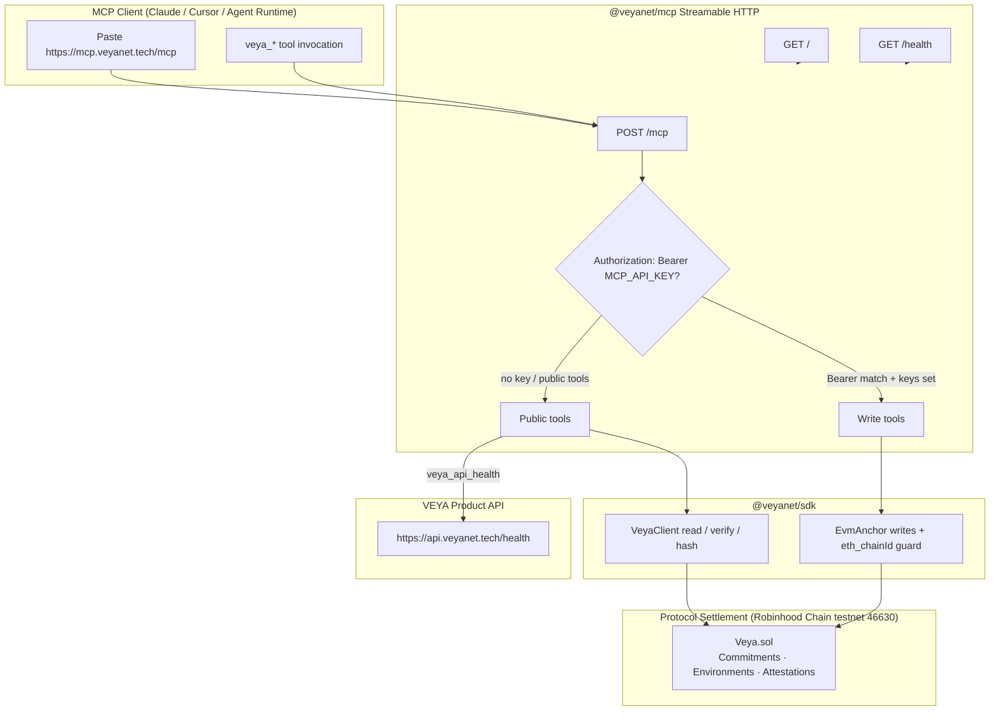

<div align="center">
  

  # VEYA MCP

  **The official Model Context Protocol server for post-quantum agent tools, chain verification, sealed-execution honesty, and protocol settlement on Robinhood Chain.**

  [](https://opensource.org/licenses/MIT)
  [](./package.json)
  [](https://nodejs.org)
  [](https://www.typescriptlang.org/)
  [](https://mcp.veyanet.tech/mcp)

  **[Official Website](https://veyanet.tech)** • **[X (Twitter)](https://x.com/withveya)** • **[Public MCP URL](https://mcp.veyanet.tech/mcp)** • **[Documentation Index](./docs/README.md)** • **[Network Specifications](./docs/NETWORK_PIN.md)** • **[Security Policy](./SECURITY.md)**

</div>

---

## 💡 Information: What is VEYA?

The **VEYA Protocol** is a decentralized, cryptographically shielded execution layer engineered for post-quantum resilient autonomous agent fleets on **Robinhood Chain**. Traditional LLM agent frameworks suffer from severe structural vulnerabilities: because agents require private execution contexts—such as API integration credentials, proprietary system prompts, treasury authority, and policy rules—running them in standard host runtimes exposes sensitive state in plaintext to host operators, database administrators, and network intermediaries.

VEYA solves this security gap by establishing client-side cryptographic boundaries and post-quantum attestation primitives. Sensitive agent workloads are protected through local post-quantum key generation (**ML-DSA-44**), quantum-resistant session negotiation (**Kyber-768**), high-throughput cryptographic digests (**BLAKE3-256**), sealed execution with **AES-256-GCM** (software sealed-node — not Intel SGX / AWS Nitro / live FHE), and **2-of-3 multi-node consensus**. Settlement today is Robinhood Chain **testnet 46630**. Mainnet is Phase 3.

### The VEYA MCP Server

The `@veyanet/mcp` package is the canonical **Model Context Protocol** surface for VEYA. It speaks Streamable HTTP so Claude, Cursor, and other MCP clients can paste a single URL and invoke VEYA tools without cloning `@veyanet/sdk` or running a local stdio binary. Cryptography, chain-id guards, and receipt parsing are delegated to `@veyanet/sdk`; this package owns the HTTP transport, tool registration, Bearer write gates, and the public honesty card.

By connecting an MCP client to `@veyanet/mcp`, you enable the following core capabilities:
*   **Paste-URL Access**: Connect via `https://mcp.veyanet.tech/mcp` (Streamable HTTP) with no local process for strangers.
*   **Public Read Tools**: Describe the stack honestly, ping Robinhood Chain, compute BLAKE3 digests, verify `Veya.sol` transactions, and probe `https://api.veyanet.tech/health`.
*   **Fail-Closed Writes**: Optional on-chain tools (`storeCommitment`, `attestExecution`, `registerEnvironment`) require `MCP_API_KEY` + relayer key and `Authorization: Bearer`.
*   **SDK-Backed Settlement**: Every chain call uses `@veyanet/sdk` (`VeyaClient` / `EvmAnchor`) with chain id **46630** pins.
*   **Operator Stdio Sibling**: Local stdio MCP remains at `veya-anchor/packages/mcp/` for process-local operators; public clients use this HTTP MCP.

| Surface | Path in tree | How users connect |
|---------|--------------|-------------------|
| **MCP (primary)** | `robinhood/hosted-mcp/` (`@veyanet/mcp`) | Paste `https://mcp.veyanet.tech/mcp` |
| Stdio (operators) | `veya-anchor/packages/mcp/` | Local `veya-mcp` process |
| SDK | `robinhood/sdk/` (`@veyanet/sdk`) | Library import |

---

## 📖 Table of Contents

1. [Architectural Design Philosophy](#-architectural-design-philosophy)
2. [High-Level MCP Data Flow](#-high-level-mcp-data-flow)
3. [Installation & Environmental Requirements](#-installation--environmental-requirements)
4. [Server Configuration & Initialization](#-server-configuration--initialization)
5. [Connect in Claude / Cursor](#-connect-in-claude--cursor)
6. [Core Tools Overview](#-core-tools-overview)
    * [Honesty & Discovery](#1-honesty--discovery)
    * [Chain Read & Verify](#2-chain-read--verify)
    * [BLAKE3 Commitment Helper](#3-blake3-commitment-helper)
    * [Product API Health](#4-product-api-health)
    * [Authenticated On-Chain Writes](#5-authenticated-on-chain-writes)
7. [Comprehensive Quickstart](#-comprehensive-quickstart)
8. [Transport, Auth & Reliability](#-transport-auth--reliability)
9. [Advanced Cryptography Boundaries](#-advanced-cryptography-boundaries)
10. [Operator Diagnostics & CLI Tools](#-operator-diagnostics--cli-tools)
11. [Documentation Directory Index](#-documentation-directory-index)
12. [Frequently Asked Questions (FAQ)](#-frequently-asked-questions-faq)
13. [Contributing & Security Guidelines](#-contributing--security-guidelines)
14. [License](#-license)

---

## 🛡️ Architectural Design Philosophy

The design of `@veyanet/mcp` is governed by the paradigm of **Thin Protocol Gate over Thick Cryptographic Client**. In naive MCP servers, business logic, secrets, and chain writes are mixed into tool handlers with soft auth. VEYA separates those concerns: the MCP process is a transport and policy shell; `@veyanet/sdk` remains the cryptographic engine that executes hashing, verification, and `EvmAnchor` writes.

This core philosophy is implemented through three primary architectural pillars:

### 1. Streamable HTTP as the Public Contract
Strangers and agent runtimes connect with a single URL. The server implements MCP Streamable HTTP (`POST /mcp`) using `@modelcontextprotocol/sdk`. No stdio binary is required for the public path. Operators who need a local process keep the stdio sibling under Anchor.

### 2. Fail-Closed Write Surface
On-chain write tools are registered only when **both** `MCP_API_KEY` and `VEYA_RELAYER_PRIVATE_KEY` (or `VEYA_DEPLOYER_PRIVATE_KEY`) are present. Every write invocation still requires `Authorization: Bearer <MCP_API_KEY>`. If either key is missing, the server exposes public reads plus `veya_writes_status` — it does not silently accept chain mutations.

### 3. Honesty Before Marketing
`GET /health` and `veya_describe` state Robinhood **testnet 46630**, sealed = **AES-256-GCM** (not FHE), not mainnet, and whether writes are enabled. The MCP will not invent quorum, claim TEE hardware attestation, or present `Veya.sol` as an ERC-20.

---

## ⚡ High-Level MCP Data Flow

The following diagram illustrates how `@veyanet/mcp` accepts Streamable HTTP tool calls, gates writes, and settles through `@veyanet/sdk` onto Robinhood Chain:



---

## 📦 Installation & Environmental Requirements

### Runtime Compatibility & Prerequisites
The `@veyanet/mcp` server is engineered for modern Node.js and ESM builds via `tsup`:

*   **Node.js Runtime**: Version **20.0.0** or higher (`engines.node >= 20`).
*   **TypeScript**: Version **5.0** or higher targeting `ES2022` / `ESNext` for local development.
*   **Sibling SDK**: `@veyanet/sdk` resolved via `file:../sdk` — build the SDK before installing this package.
*   **Network**: Outbound HTTPS to Robinhood Chain RPC (and optionally `api.veyanet.tech`).

### Package Installation (Monorepo)

```bash
cd robinhood/sdk
npm install
npm run build

cd ../hosted-mcp
npm install
npm run build
```

Start the server:

```bash
npm start
# → http://127.0.0.1:8788/mcp
# → http://127.0.0.1:8788/health
```

Binary entry after build: `veya-mcp` → `./dist/cli.js`.

---

## 🔑 Server Configuration & Initialization

The process loads configuration from environment variables with Robinhood testnet defaults. Copy `.env.example` to `.env` for local overrides. **Never commit `.env`.**

### Configuration Resolution Cascade
Parameters resolve from process environment first, then package defaults (testnet **46630**, public RPC, `Veya.sol` address, `PUBLIC_MCP_URL=https://mcp.veyanet.tech/mcp`).

```typescript
import { loadConfig, createHttpApp, startHttpServer } from "@veyanet/mcp";

// 1. Zero-config start (testnet defaults)
startHttpServer();

// 2. Explicit config for operators
const cfg = loadConfig();
const app = createHttpApp(cfg);
app.listen(cfg.port, cfg.host);
```

### Environment Variables Reference

| Variable Name | Description | Default / Fallback |
|---------------|-------------|--------------------|
| `PUBLIC_MCP_URL` | Public paste URL advertised in landing + health | `https://mcp.veyanet.tech/mcp` |
| `PORT` | Listen port | `8788` |
| `HOST` | Bind address | `0.0.0.0` |
| `ROBINHOOD_RPC_URL` | Network JSON-RPC endpoint | Public testnet RPC |
| `ROBINHOOD_CHAIN_ID` | Network chain ID | `46630` |
| `ROBINHOOD_EXPLORER_URL` | Block explorer base URL | Public testnet explorer |
| `VEYA_CONTRACT_ADDRESS` | `Veya.sol` protocol contract | Testnet deploy address |
| `VEYA_API_URL` | Product API base for `veya_api_health` | `https://api.veyanet.tech` |
| `MCP_API_KEY` | Bearer secret for write tools | unset → reads only |
| `VEYA_RELAYER_PRIVATE_KEY` | Payer key for on-chain writes | unset → reads only |
| `VEYA_DEPLOYER_PRIVATE_KEY` | Alternate payer env name | same role as relayer |
| `CORS_ORIGIN` | Comma-separated Origin allowlist | empty = reject credentialed browser Origin |
| `NODE_ENV` | Runtime mode | `development` |

---

## 🔌 Connect in Claude / Cursor

### Production (strangers / public clients)

Paste into a custom MCP connector using **Streamable HTTP** transport:

```text
https://mcp.veyanet.tech/mcp
```

No API key is required for public tools. Write tools only appear or succeed when the server operator enabled keys and the client sends Bearer auth.

### Claude CLI (local development)

```bash
claude mcp add veya --transport http http://127.0.0.1:8788/mcp
```

### Cursor IDE

Settings → MCP → Add custom MCP server / connector → URL:

```text
https://mcp.veyanet.tech/mcp
```

For local verification use `http://127.0.0.1:8788/mcp` against `npm start`.

### Landing Page

`GET https://mcp.veyanet.tech/` (or local `/`) returns a minimal HTML page with the paste URL, health link, and honesty line (testnet 46630 · AES-256-GCM · not mainnet).

---

## 🧩 Core Tools Overview

The `@veyanet/mcp` tool surface is split into public reads and authenticated writes. Each tool returns MCP text content (typically JSON) for agent consumption.

### 1. Honesty & Discovery

```text
Tool: veya_describe
Args: (none)
```

Returns the honesty card: package name `@veyanet/mcp`, public URL, settlement (chain id, contract, RPC, explorer), product API, sealed = AES-256-GCM (not FHE), mainnet deferred to Phase 3, write policy, and pointer to the stdio sibling.

```text
Tool: veya_writes_status
Args: (none)
```

Present when write tools are **disabled**. Reports that `MCP_API_KEY` + `VEYA_RELAYER_PRIVATE_KEY` must be set to enable on-chain tools.

### 2. Chain Read & Verify

```text
Tool: veya_ping_chain
Args: (none)
```

Uses `@veyanet/sdk` `VeyaClient.pingChain()` against the configured RPC. Confirms chain id matches config (**46630** on testnet) and returns block metadata.

```text
Tool: veya_verify_transaction
Args: txHash (0x…, min 66 chars)
```

Parses `Veya.sol` receipt events via SDK `verifyTransaction` (CommitmentStored / ExecutionAttested / related). Use a real Robinhood explorer hash.

**Example known testnet commitment tx:**

```text
0xd68ab19671f0a3be63651cb6d6e24f5decf591da981708502827bca3689d31d8
```

### 3. BLAKE3 Commitment Helper

```text
Tool: veya_hash_blake3
Args: data (string, min length 1)
```

Computes a BLAKE3-256 hex digest through the SDK. Useful before an authenticated `veya_store_commitment` or for local commitment previews.

### 4. Product API Health

```text
Tool: veya_api_health
Args: (none)
```

`GET {VEYA_API_URL}/health` (default `https://api.veyanet.tech/health`). Returns HTTP status and JSON body. The API may report `degraded` when validators/sealed are down — that is honest, not a failure of this MCP process.

### 5. Authenticated On-Chain Writes

Enabled only when **both** server env keys exist. Client must send:

```http
Authorization: Bearer <MCP_API_KEY>
```

| Tool | Primary args | On-chain method |
|------|----------------|-----------------|
| `veya_store_commitment` | `environmentUuidHex`, `commitmentHex` | `storeCommitment` |
| `veya_attest_execution` | `environmentUuidHex`, `blake3HashHex`, `mldsaSigHex` | `attestExecution` |
| `veya_register_environment` | `environmentUuidHex`, `pqPubkeyHashHex`, `envType` | `registerEnvironment` |

Writes go through SDK `EvmAnchor`, which calls `ensureRobinhoodChain()` before submit so a mis-pointed RPC cannot silently land on another EVM.

---

## 🚀 Comprehensive Quickstart

### A. Stranger path (no keys, no clone)

1. Open Claude or Cursor MCP settings.
2. Add Streamable HTTP URL: `https://mcp.veyanet.tech/mcp`.
3. Ask the agent to run `veya_describe`.
4. Ask the agent to run `veya_ping_chain` and confirm chain id **46630**.
5. Ask the agent to run `veya_verify_transaction` with a known `Veya.sol` tx hash.

### B. Developer path (local process)

```bash
cd robinhood/sdk && npm install && npm run build
cd ../hosted-mcp && npm install && npm run build
cp .env.example .env   # do not commit .env
npm start
```

In another terminal:

```bash
npm test
npm run smoke
```

Smoke starts an in-process server, performs MCP initialize + `tools/list`, then calls `veya_describe` and `veya_ping_chain` against live RPC.

### C. Operator write path (funded testnet key)

1. Set `MCP_API_KEY` to a long random secret.
2. Set `VEYA_RELAYER_PRIVATE_KEY` to a funded Robinhood **testnet** key.
3. Restart the process; confirm `/health` shows `"writesEnabled": true`.
4. From an MCP client that can set headers, call write tools with `Authorization: Bearer <MCP_API_KEY>`.
5. Confirm the returned `txHash` on the Robinhood testnet explorer.

---

## ⚠️ Transport, Auth & Reliability

### HTTP Endpoints

| Method | Path | Purpose |
|--------|------|---------|
| `GET` | `/` | Landing HTML with paste URL |
| `GET` | `/health` | Honesty JSON (service, version, chain, writesEnabled, sealed) |
| `POST` | `/mcp` | Stateless Streamable HTTP MCP |
| `POST` | `/mcp/session` | Optional sessionful path (`MCP-Session-Id`) |

### CORS
`CORS_ORIGIN` is an allowlist. Empty allowlist rejects credentialed browser `Origin` values. Server-to-server MCP clients (no Origin) are unaffected.

### Auth Model
*   Public tools: no Bearer required.
*   Write tools: Bearer must equal `MCP_API_KEY`; relayer key must be configured; mismatch throws and fails the tool call.
*   Relayer private keys never appear in tool responses or `/health`.

### Failure Modes
*   Wrong RPC chain id on writes → SDK `CHAIN_MISMATCH` (fail closed).
*   Missing write keys → write tools not registered (or `veya_writes_status` only).
*   Bad Bearer → unauthorized error on write tools.
*   Downstream API degraded → `veya_api_health` returns honest body; MCP itself can still be `status: ok`.

---

## 🔒 Advanced Cryptography Boundaries

`@veyanet/mcp` does **not** re-implement PQ algorithms. It calls `@veyanet/sdk`, which provides:

### 1. ML-DSA-44 Post-Quantum Identity (FIPS 204)
Used when operators submit attestation signature bytes through `veya_attest_execution`. Verification of ML-DSA remains off-chain in the SDK / auditors; the chain stores bounded attestation bytes and hashes.

### 2. BLAKE3-256 Digesting
`veya_hash_blake3` and commitment writes use 32-byte digests. Use-mode human content proofs on the product site may use SHA-256 for browser convenience; MCP commitment helpers follow the SDK BLAKE3 path.

### 3. AES-256-GCM Sealed Execution
Sealed execution is **not** executed inside this MCP process by default. Honesty strings state sealed = AES-256-GCM elsewhere in the stack. This is **not** Intel SGX, **not** AWS Nitro, and **not** live FHE (TFHE is a later phase).

### 4. Chain Id Guard
`EvmAnchor.ensureRobinhoodChain()` runs before on-chain writes so MCP operators cannot accidentally settle on the wrong EVM.

---

## 🛠️ Operator Diagnostics & CLI Tools

The package ships with verification scripts for operators and publishers:

```bash
# Typecheck
npm run lint

# Unit + HTTP /health honesty (service name, chainId, AES string)
npm test

# Live MCP initialize + tools/list + ping (needs network)
npm run smoke

# Production-style process
npm run build && npm start
```

Health probe:

```bash
curl -s https://mcp.veyanet.tech/health | jq .
# or local:
curl -s http://127.0.0.1:8788/health | jq .
```

Expected honesty fields include `service: "@veyanet/mcp"`, `chainId: 46630`, `sealed` mentioning `AES-256-GCM`, and `writesEnabled` boolean.

Production TLS for `mcp.veyanet.tech`: see **[Deployment Guide](./docs/DEPLOYMENT.md)** and tree doc `docs/phase2/MCP.md`.

---

## 📚 Documentation Directory Index

This README serves as the entry point. For detailed operational and integrator material, refer to the documentation directory:

| Document | Topic | Description |
|----------|-------|-------------|
| **[Documentation Hub](./docs/README.md)** | Index | Master catalog and reading paths for strangers vs operators. |
| **[Network Specifications](./docs/NETWORK_PIN.md)** | Network | Chain id, RPC, explorer, `Veya.sol` address, public MCP URL. |
| **[Quickstart Guide](./docs/QUICKSTART.md)** | Tutorial | Paste URL → first tools → local loop → smoke. |
| **[System Architecture](./docs/ARCHITECTURE.md)** | Security | Trust boundaries between MCP, SDK, API, and chain. |
| **[Tools Reference](./docs/TOOLS.md)** | Reference | Every `veya_*` tool, args, and auth requirements. |
| **[Verification Guide](./docs/VERIFICATION.md)** | Audit | How to prove a commitment via MCP + explorer. |
| **[Deployment Guide](./docs/DEPLOYMENT.md)** | Operations | nginx, env, systemd, TLS for `mcp.veyanet.tech`. |
| **[Configuration Reference](./docs/CONFIGURATION.md)** | Config | Full environment variable cascade and defaults. |
| **[HTTP Transport](./docs/TRANSPORT.md)** | Protocol | Streamable HTTP, sessions, CORS, Accept headers. |
| **[Authentication & Writes](./docs/AUTHENTICATION.md)** | Security | Bearer model, key custody, fail-closed writes. |
| **[SDK Relationship](./docs/SDK_BRIDGE.md)** | Integration | What MCP calls in `@veyanet/sdk` and what it does not. |
| **[Changelog](./CHANGELOG.md)** | History | Package version history. |
| **[Security Policy](./SECURITY.md)** | Security | Disclosure and secrets hygiene. |

---

## ❓ Frequently Asked Questions (FAQ)

### 1. Do I need an API key to try VEYA MCP?
**No** for public tools (`veya_describe`, `veya_ping_chain`, `veya_hash_blake3`, `veya_verify_transaction`, `veya_api_health`). Write tools require the server operator to enable keys and the client to send `Authorization: Bearer <MCP_API_KEY>`.

### 2. Does the MCP store or transmit my private keys to clients?
**No.** Relayer / deployer keys stay in server process memory for write tools only. They are never returned in tool payloads or `/health`. `MCP_API_KEY` is a shared Bearer secret for authorized writers — treat it like a production password.

### 3. Is Veya.sol an ERC-20 token?
**No.** `Veya.sol` is a protocol contract for environments, agents, commitments, spending limits (wei), nullifiers, and attestations. It does not implement ERC-20.

### 4. Is sealed execution FHE or hardware TEE?
**No.** Product honesty is **AES-256-GCM** sealed-node cryptography. Not live FHE/TFHE (later phase). Not Intel SGX / AWS Nitro as the product path.

### 5. How is MCP different from `@veyanet/sdk`?
The SDK is a TypeScript library you import. MCP is a network service that exposes selected SDK capabilities as MCP tools over Streamable HTTP so agents can paste a URL.

### 6. Where is the stdio MCP?
Local operator stdio lives at `veya-anchor/packages/mcp/`. Public Claude / Cursor users should use `https://mcp.veyanet.tech/mcp`.

### 7. What happens if Robinhood RPC is down?
`veya_ping_chain` and verify tools fail with transport / RPC errors. `/health` can still report the MCP process as up while chain tools fail — operators should monitor both.

### 8. Can I point this server at another chain id?
Only if you change `ROBINHOOD_CHAIN_ID`, RPC, explorer, and contract together. SDK write guards will reject chain id mismatch. Mainnet is not a VEYA settlement claim until Phase 3.

---

## 🤝 Contributing & Security Guidelines

### Contribution Standards
We welcome contributions to `@veyanet/mcp`. Pull requests must preserve security integrity:
*   **Fail-Closed Writes**: Do not register on-chain tools without both API key and relayer key; do not accept writes without Bearer match.
*   **Honesty Enforcement**: Do not add tool copy that claims FHE, mainnet settlement, ERC-20, or invented quorum.
*   **Secret Hygiene**: Reject changes that log `MCP_API_KEY`, relayer keys, or dump `.env` into docs.
*   **SDK Boundary**: Prefer calling `@veyanet/sdk` over re-implementing hashing, verify, or `EvmAnchor` inside tool handlers.

### Vulnerability Disclosure Policy
If you discover a security vulnerability, **do not file a public GitHub issue**.
Submit findings confidentially to **security@veyanet.tech**. See our [Security Policy](./SECURITY.md) for full details.

---

## 📄 License

This package is licensed under the **MIT License**. See the [LICENSE](LICENSE) file for legal details.
