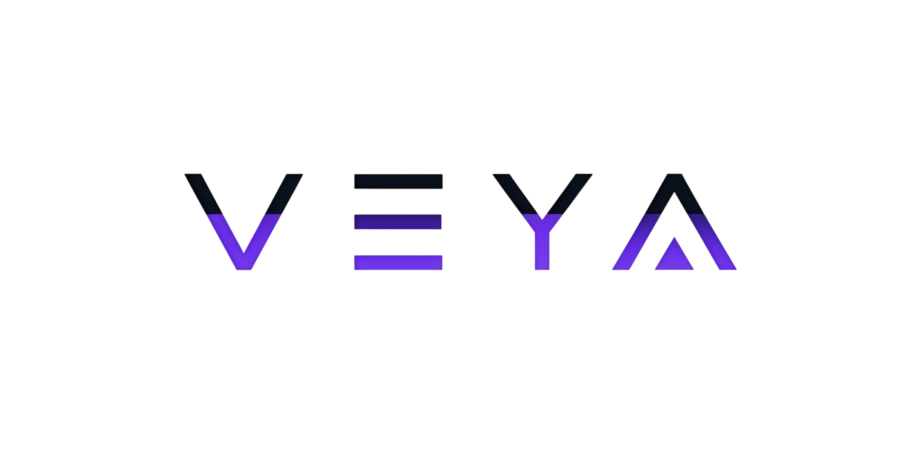
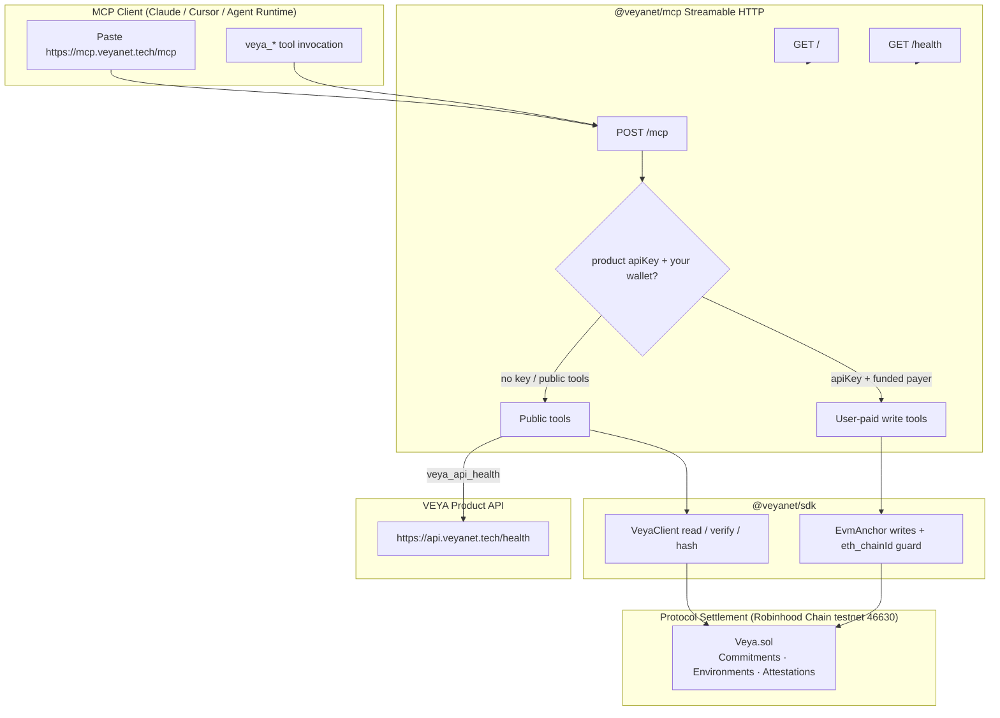

<div align="center">
  

  # VEYA MCP

  **The official Model Context Protocol server for post-quantum agent tools, chain verification, sealed-execution honesty, and protocol settlement on Robinhood Chain.**

  [](https://opensource.org/licenses/MIT)
  [](./package.json)
  [](https://nodejs.org)
  [](https://www.typescriptlang.org/)
  [](https://mcp.veyanet.tech/mcp)

  **[Official Website](https://veyanet.tech)** • **[X (Twitter)](https://x.com/withveya)** • **[Public MCP URL](https://mcp.veyanet.tech/mcp)** • **[Documentation Index](./docs/README.md)** • **[Network Specifications](./docs/NETWORK_PIN.md)** • **[Security Policy](./SECURITY.md)**

</div>

---

## 💡 Information: What is VEYA?

The **VEYA Protocol** is a decentralized, cryptographically shielded execution layer engineered for post-quantum resilient autonomous agent fleets on **Robinhood Chain**. Traditional LLM agent frameworks suffer from severe structural vulnerabilities: because agents require private execution contexts—such as API integration credentials, proprietary system prompts, treasury authority, and policy rules—running them in standard host runtimes exposes sensitive state in plaintext to host operators, database administrators, and network intermediaries.

VEYA solves this security gap by establishing client-side cryptographic boundaries and post-quantum attestation primitives. Sensitive agent workloads are protected through local post-quantum key generation (**ML-DSA-44**), quantum-resistant session negotiation (**Kyber-768**), high-throughput cryptographic digests (**BLAKE3-256**), sealed execution with **AES-256-GCM** (software sealed-node — not Intel SGX / AWS Nitro / live FHE), and **2-of-3 multi-node consensus**. Settlement today is Robinhood Chain **testnet 46630**. Mainnet is Phase 3.

### The VEYA MCP Server

The `@veyanet/mcp` package is the canonical **Model Context Protocol** surface for VEYA — the full agent-facing picture, not a teaser subset. It speaks Streamable HTTP so Claude, Cursor, and other MCP clients can paste a single URL and invoke crypto, fleet, registry, product API, and user-paid on-chain write tools without cloning `@veyanet/sdk`. Cryptography, chain-id guards, and receipt parsing are delegated to `@veyanet/sdk`; this package owns the HTTP transport, tool registration, product `apiKey` forwarding, and the public honesty card.

By connecting an MCP client to `@veyanet/mcp`, you enable the following core capabilities:
*   **Paste-URL Access**: Connect via `https://mcp.veyanet.tech/mcp` (Streamable HTTP).
*   **Public Tools**: Describe the stack, ping Robinhood Chain, BLAKE3, verify `Veya.sol` txs, PQ crypto, registry, product sessions via `https://api.veyanet.tech`.
*   **User-paid writes**: On-chain tools need a product API key (`veya_dev_` / `veya_live_`) and **your** funded testnet wallet. The hosted relayer is not the gas payer.
*   **SDK-Backed Settlement**: Chain calls use `@veyanet/sdk` with chain id **46630** pins.
*   **Backend-owned fleet**: Consensus validators and sealed capacity belong to the product API (`https://api.veyanet.tech`).

| Surface | How users connect |
|---------|-------------------|
| **Public MCP** | Paste `https://mcp.veyanet.tech/mcp` |
| **Product API** | `https://api.veyanet.tech` (via MCP tools or direct HTTPS) |
| **SDK** | `npm install @veyanet/sdk` |

---

## 📖 Table of Contents

1. [Architectural Design Philosophy](#-architectural-design-philosophy)
2. [High-Level MCP Data Flow](#-high-level-mcp-data-flow)
3. [Installation & Environmental Requirements](#-installation--environmental-requirements)
4. [Server Configuration & Initialization](#-server-configuration--initialization)
5. [Connect in Claude / Cursor](#-connect-in-claude--cursor)
6. [Core Tools Overview](#-core-tools-overview)
    * [Honesty & Discovery](#1-honesty--discovery)
    * [Chain Read & Verify](#2-chain-read--verify)
    * [BLAKE3 Commitment Helper](#3-blake3-commitment-helper)
    * [Product API Health](#4-product-api-health)
    * [Authenticated On-Chain Writes](#5-authenticated-on-chain-writes)
7. [Comprehensive Quickstart](#-comprehensive-quickstart)
8. [Transport, Auth & Reliability](#-transport-auth--reliability)
9. [Advanced Cryptography Boundaries](#-advanced-cryptography-boundaries)
10. [Operator Diagnostics & CLI Tools](#-operator-diagnostics--cli-tools)
11. [Documentation Directory Index](#-documentation-directory-index)
12. [Frequently Asked Questions (FAQ)](#-frequently-asked-questions-faq)
13. [Contributing & Security Guidelines](#-contributing--security-guidelines)
14. [License](#-license)

---

## 🛡️ Architectural Design Philosophy

The design of `@veyanet/mcp` is governed by the paradigm of **Thin Protocol Gate over Thick Cryptographic Client**. In naive MCP servers, business logic, secrets, and chain writes are mixed into tool handlers with soft auth. VEYA separates those concerns: the MCP process is a transport and policy shell; `@veyanet/sdk` remains the cryptographic engine that executes hashing, verification, and `EvmAnchor` writes.

This core philosophy is implemented through three primary architectural pillars:

### 1. Streamable HTTP as the Public Contract
Strangers and agent runtimes connect with a single URL. The server implements MCP Streamable HTTP (`POST /mcp`) using `@modelcontextprotocol/sdk`.

### 2. User-paid write surface
On-chain write tools are always registered. Product writes need a product `apiKey` and your `payerPrivateKey`. `veya_prove` is separate: a read needs no key, and an anchor needs `environmentId` plus `payerPrivateKey` only. `msg.sender` is **your** address. An empty wallet returns: `You don't have testnet tokens. Please get them for the transaction.`

### 3. Honesty Before Marketing
`GET /health` and `veya_describe` state Robinhood **testnet 46630**, sealed = **AES-256-GCM**, and whether writes are enabled. Quorum is matching hashes; unreachable nodes return `consensus_reached: false`. `Veya.sol` is a protocol contract.

---

## ⚡ High-Level MCP Data Flow

The following diagram illustrates how `@veyanet/mcp` accepts Streamable HTTP tool calls, gates writes, and settles through `@veyanet/sdk` onto Robinhood Chain:


```mermaid
flowchart TB
    subgraph ClientSpace["MCP Client (Claude / Cursor / Agent Runtime)"]
        PasteURL["Paste https://mcp.veyanet.tech/mcp"]
        ToolCall["veya_* tool invocation"]
    end

    subgraph McpBoundary["@veyanet/mcp Streamable HTTP"]
        Landing["GET /"]
        Health["GET /health"]
        PostMcp["POST /mcp"]
        Auth{"product apiKey + your wallet?"}
        PublicTools["Public tools"]
        WriteTools["User-paid write tools"]
    end

    subgraph SdkBoundary["@veyanet/sdk"]
        ReadClient["VeyaClient read / verify / hash"]
        EvmAnchor["EvmAnchor writes + eth_chainId guard"]
    end

    subgraph ApiBoundary["VEYA Product API"]
        ApiHealth["https://api.veyanet.tech/health"]
    end

    subgraph Blockchain["Protocol Settlement (Robinhood Chain testnet 46630)"]
        VeyaSol["Veya.sol\nCommitments · Environments · Attestations"]
    end

    PasteURL --> PostMcp
    ToolCall --> PostMcp
    PostMcp --> Auth
    Auth -->|"no key / public tools"| PublicTools
    Auth -->|"apiKey + funded payer"| WriteTools
    PublicTools --> ReadClient
    PublicTools -->|"veya_api_health"| ApiHealth
    WriteTools --> EvmAnchor
    ReadClient --> VeyaSol
    EvmAnchor --> VeyaSol
    Landing --> McpBoundary
    Health --> McpBoundary
```

---

## 📦 Installation & Environmental Requirements

### Strangers (recommended)

Paste into Claude / Cursor (**Streamable HTTP**):

```text
https://mcp.veyanet.tech/mcp
```

Optional TypeScript library:

```bash
npm install @veyanet/sdk
```

### npm package (optional)

```bash
npm install -g @veyanet/mcp
veya-mcp
# or: npx -y @veyanet/mcp
```

Starts a Streamable HTTP server. After TLS, point clients at your **public HTTPS** connector. Keep `PUBLIC_MCP_URL=https://mcp.veyanet.tech/mcp` as the product paste URL in docs and landing. See [docs/DEPLOYMENT.md](./docs/DEPLOYMENT.md).

### Requirements

*   **Node.js** ≥ **20**
*   Outbound HTTPS to Robinhood RPC and `https://api.veyanet.tech`
*   Dependency: `@veyanet/sdk` from **npm**

---

## 🔑 Server Configuration & Initialization

The process loads configuration from environment variables with Robinhood testnet defaults. Copy `.env.example` to `.env` for local overrides. **Never commit `.env`.**

### Configuration Resolution Cascade
Parameters resolve from process environment first, then package defaults (testnet **46630**, public RPC, `Veya.sol` address, `PUBLIC_MCP_URL=https://mcp.veyanet.tech/mcp`).

```typescript
import { loadConfig, createHttpApp, startHttpServer } from "@veyanet/mcp";

// 1. Zero-config start (testnet defaults)
startHttpServer();

// 2. Explicit config for operators
const cfg = loadConfig();
const app = createHttpApp(cfg);
app.listen(cfg.port, cfg.host);
```

### Environment Variables Reference

| Variable Name | Description | Default / Fallback |
|---------------|-------------|--------------------|
| `PUBLIC_MCP_URL` | Public paste URL advertised in landing + health | `https://mcp.veyanet.tech/mcp` |
| `PORT` | Listen port | `8788` |
| `HOST` | Bind address | `0.0.0.0` |
| `ROBINHOOD_RPC_URL` | Network JSON-RPC endpoint | Public testnet RPC |
| `ROBINHOOD_CHAIN_ID` | Network chain ID | `46630` |
| `ROBINHOOD_EXPLORER_URL` | Block explorer base URL | Public testnet explorer |
| `VEYA_CONTRACT_ADDRESS` | `Veya.sol` protocol contract | Testnet deploy address |
| `VEYA_API_URL` | Product API (health, registry, sessions, fleet capacity) | `https://api.veyanet.tech` |
| `VEYA_VALIDATOR_NODES` | Backend fleet URLs (server-side; not stranger loopback) | configured per host |
| `VEYA_SEALED_NODE_URL` | Sealed capacity URL (backend-owned) | configured per host |
| `VEYA_PAYER_PRIVATE_KEY` | Self-hosted payer for product write tools | `veya_prove` does not read this. Pass `payerPrivateKey` on an anchor call |
| `MCP_API_KEY` | Operator relayer path only | unset on the public host |
| `VEYA_RELAYER_PRIVATE_KEY` | Unused by `veya_prove` | unset on the public host |
| `VEYA_DEPLOYER_PRIVATE_KEY` | SDK payer when `VeyaClient` is constructed without `payerPrivateKey` | unset on the public host |
| `CORS_ORIGIN` | Comma-separated Origin allowlist | empty = reject credentialed browser Origin |
| `NODE_ENV` | Runtime mode | `development` |

---

## 🔌 Connect in Claude / Cursor

### Production (strangers / public clients)

Paste into a custom MCP connector using **Streamable HTTP** transport:

```text
https://mcp.veyanet.tech/mcp
```

No API key is required for public tools, including `veya_prove`. Product tools need `apiKey`. Product on-chain writes need that key plus **your** funded testnet wallet. An anchor through `veya_prove` needs `environmentId` and `payerPrivateKey` only.

### Claude CLI

```bash
claude mcp add veya --transport http https://mcp.veyanet.tech/mcp
```

### Cursor IDE

Settings → MCP → Add custom MCP server / connector → URL:

```text
https://mcp.veyanet.tech/mcp
```

### Landing Page

`GET https://mcp.veyanet.tech/` returns a brand landing that advertises **`https://mcp.veyanet.tech/mcp`**. Health: `https://mcp.veyanet.tech/health`. Product docs: `https://veyanet.tech/mcp`. Product API: `https://api.veyanet.tech`.

---

## 🧩 Core Tools Overview

`@veyanet/mcp` **1.2.3** exposes the full agent surface. Full schemas: [docs/TOOLS.md](./docs/TOOLS.md). Reads are free. Product tools need a site API key. Product on-chain writes spend **your** wallet and also need that API key. `veya_prove` does not.

### 0. Proof

```text
Tool: veya_prove
Args: exactly one of text, json, txHash
      anchor, environmentId, payerPrivateKey only when anchoring
```

One proof from text, a JSON string, or a receipt hash. Paste `https://mcp.veyanet.tech/mcp` in Cursor before the run, or the tool is not in the agent's tool list. The URL accepts `POST`. The response is a stream (`event: message` and a `data:` line).

A read sends nothing:

```json
{ "text": "hello" }
```

Text `hello` returns `mode` `digest`, `anchored` false, and digest `ea8f163db38682925e4491c5e58d4bb3506ef8c14eb78a86e908c5624a67200f`.

An anchor sends one `storeCommitment` from the wallet in `payerPrivateKey`. It does not use a product `apiKey`, and it does not use the host relayer. The environment id must already exist on `Veya.sol`. This one does: `7d0af0ba-2ae3-4d0e-bc75-0bbaccb3dd71`. A 32-hex bytes16 also parses. A hyphenated id must be a real UUID, so `00000000-0000-0000-0000-000000000001` is refused.

```json
{
  "text": "a unique string",
  "anchor": true,
  "environmentId": "7d0af0ba-2ae3-4d0e-bc75-0bbaccb3dd71",
  "payerPrivateKey": "<funded private key>"
}
```

A receipt with no VEYA log and a receipt that called another contract both return the full proof object: `ok` false, `mode` `refused`, `inputKind` `tx`, `anchored` false, plus `txHash`, `explorerUrl`, and `refusal`.

### 1. Honesty & Discovery

```text
Tool: veya_describe
Args: (none)
```

Returns the honesty card: package name `@veyanet/mcp`, public URL, settlement, product API, sealed = AES-256-GCM, write policy.

```text
Tool: veya_writes_status
Args: (none)
```

Always registered. Explains user-paid writes: product `apiKey` + your wallet. Empty wallet message is included.

### 2. Chain Read & Verify

```text
Tool: veya_ping_chain
Args: (none)
```

Uses `@veyanet/sdk` `VeyaClient.pingChain()` against the configured RPC. Confirms chain id matches config (**46630** on testnet) and returns block metadata.

```text
Tool: veya_verify_transaction
Args: txHash (0x…, min 66 chars)
```

Parses `Veya.sol` receipt events via SDK `verifyTransaction` (CommitmentStored / ExecutionAttested / related). Use a real Robinhood explorer hash.

**Example known testnet commitment tx:**

```text
0xd68ab19671f0a3be63651cb6d6e24f5decf591da981708502827bca3689d31d8
```

### 3. BLAKE3 Commitment Helper

```text
Tool: veya_hash_blake3
Args: data (string, min length 1)
```

Computes a BLAKE3-256 hex digest through the SDK. Useful before an authenticated `veya_store_commitment` or for local commitment previews.

### 4. Product API Health

```text
Tool: veya_api_health
Args: (none)
```

`GET {VEYA_API_URL}/health` (default `https://api.veyanet.tech/health`). Returns HTTP status and JSON body. The API may report `degraded` when validators/sealed are down — that is honest, not a failure of this MCP process.

### 5. Authenticated On-Chain Writes

Always available. `msg.sender` is **your** wallet, not the hosted relayer.

| Tool | Primary args | On-chain method |
|------|----------------|-----------------|
| `veya_store_commitment` | `apiKey`, `payerPrivateKey`, `environmentUuidHex`, `commitmentHex` | `storeCommitment` |
| `veya_attest_execution` | `apiKey`, `payerPrivateKey`, `environmentUuidHex`, `blake3HashHex`, `mldsaSigHex` | `attestExecution` |
| `veya_register_environment` | `apiKey`, `payerPrivateKey`, `environmentId` or `environmentUuidHex` | `registerEnvironment` |

Writes go through SDK `EvmAnchor`, which calls `ensureRobinhoodChain()` before submit so a mis-pointed RPC cannot silently land on another EVM. If the wallet has no ETH: `You don't have testnet tokens. Please get them for the transaction.`

---

## 🚀 Comprehensive Quickstart

### A. Stranger path (no keys, no clone)

1. Open Claude or Cursor MCP settings.
2. Add Streamable HTTP URL: `https://mcp.veyanet.tech/mcp`.
3. Ask the agent to run `veya_prove` with `{ "text": "hello" }`.
4. Ask the agent to run `veya_describe`.
5. Ask the agent to run `veya_ping_chain` and confirm chain id **46630**.

### B. Developer path (local process)

```bash
git clone https://github.com/veyanet/veya-mcp.git
cd veya-mcp
npm install
cp .env.example .env   # do not commit .env
npm run build
npm start
```

In another terminal:

```bash
npm test
npm run smoke
```

Smoke starts an in-process server, performs MCP initialize + `tools/list`, then calls `veya_describe` and `veya_ping_chain` against live RPC.

### C. Product write path (your funded testnet wallet)

These tools need a product `apiKey`. `veya_prove` does not. An anchor on `veya_prove` is `environmentId` plus `payerPrivateKey` only.

1. Mint `veya_dev_` / `veya_live_` on the product site.
2. Set `VEYA_PAYER_PRIVATE_KEY` on a self-hosted server, or pass `payerPrivateKey` on the tool. The public `veya_prove` tool reads only the argument.
3. Call `veya_store_commitment` (or `veya_anchor_proof`) with `apiKey`.
4. Confirm `from` in the result is your address, and open the explorer `txHash`.
5. If the wallet is empty you get: `You don't have testnet tokens. Please get them for the transaction.`

---

## ⚠️ Transport, Auth & Reliability

### HTTP Endpoints

| Method | Path | Purpose |
|--------|------|---------|
| `GET` | `/` | Landing HTML with paste URL |
| `GET` | `/health` | Honesty JSON (service, version, chain, writesEnabled, sealed) |
| `POST` | `/mcp` | Stateless Streamable HTTP MCP |
| `POST` | `/mcp/session` | Optional sessionful path (`MCP-Session-Id`) |

### CORS
`CORS_ORIGIN` is an allowlist. Empty allowlist rejects credentialed browser `Origin` values. Server-to-server MCP clients (no Origin) are unaffected.

### Auth Model
*   Public tools: no key.
*   Product tools: `apiKey` from the product site (`X-Api-Key` toward `api.veyanet.tech`).
*   Write tools: same `apiKey` plus **your** `payerPrivateKey`. `from` is your address.
*   Private keys never appear in `/health` or success payloads.

### Failure Modes
*   Wrong RPC chain id on writes → SDK `CHAIN_MISMATCH` (fail closed).
*   Missing `apiKey` → `{ "error": "apiKey required" }`.
*   Unfunded payer → `You don't have testnet tokens. Please get them for the transaction.`
*   Downstream API degraded → `veya_api_health` returns honest body; MCP itself can still be `status: ok`.

---

## 🔒 Advanced Cryptography Boundaries

`@veyanet/mcp` does **not** re-implement PQ algorithms. It calls `@veyanet/sdk`, which provides:

### 1. ML-DSA-44 Post-Quantum Identity (FIPS 204)
Used when operators submit attestation signature bytes through `veya_attest_execution`. Verification of ML-DSA remains off-chain in the SDK / auditors; the chain stores bounded attestation bytes and hashes.

### 2. BLAKE3-256 Digesting
`veya_hash_blake3` and commitment writes use 32-byte digests. Use-mode human content proofs on the product site may use SHA-256 for browser convenience; MCP commitment helpers follow the SDK BLAKE3 path.

### 3. AES-256-GCM Sealed Execution
Sealed execution is **not** executed inside this MCP process by default. Honesty strings state sealed = AES-256-GCM elsewhere in the stack. This is **not** Intel SGX, **not** AWS Nitro, and **not** live FHE (TFHE is a later phase).

### 4. Chain Id Guard
`EvmAnchor.ensureRobinhoodChain()` runs before on-chain writes so MCP operators cannot accidentally settle on the wrong EVM.

---

## 🛠️ Operator Diagnostics & CLI Tools

The package ships with verification scripts for operators and publishers:

```bash
# Typecheck
npm run lint

# Unit + HTTP /health honesty (service name, chainId, AES string)
npm test

# Live MCP initialize + tools/list + ping (needs network)
npm run smoke

# Production-style process
npm run build && npm start
```

Health probe:

```bash
curl -s https://mcp.veyanet.tech/health | jq .
# or local:
curl -s https://mcp.veyanet.tech/health | jq .
```

Expected honesty fields include `service: "@veyanet/mcp"`, `chainId: 46630`, `sealed` mentioning `AES-256-GCM`, and `writesEnabled` boolean.

Production TLS for `mcp.veyanet.tech`: see **[Deployment Guide](./docs/DEPLOYMENT.md)** and tree doc `docs/phase2/MCP.md`.

---

## 📚 Documentation Directory Index

This README serves as the entry point. For detailed operational and integrator material, refer to the documentation directory:

| Document | Topic | Description |
|----------|-------|-------------|
| **[Documentation Hub](./docs/README.md)** | Index | Master catalog and reading paths for strangers vs operators. |
| **[Network Specifications](./docs/NETWORK_PIN.md)** | Network | Chain id, RPC, explorer, `Veya.sol` address, public MCP URL. |
| **[Quickstart Guide](./docs/QUICKSTART.md)** | Tutorial | Paste URL → first tools → local loop → smoke. |
| **[System Architecture](./docs/ARCHITECTURE.md)** | Security | Trust boundaries between MCP, SDK, API, and chain. |
| **[Tools Reference](./docs/TOOLS.md)** | Reference | Every `veya_*` tool, args, and auth requirements. |
| **[Verification Guide](./docs/VERIFICATION.md)** | Audit | How to prove a commitment via MCP + explorer. |
| **[Deployment Guide](./docs/DEPLOYMENT.md)** | Operations | nginx, env, systemd, TLS for `mcp.veyanet.tech`. |
| **[Configuration Reference](./docs/CONFIGURATION.md)** | Config | Full environment variable cascade and defaults. |
| **[HTTP Transport](./docs/TRANSPORT.md)** | Protocol | Streamable HTTP, sessions, CORS, Accept headers. |
| **[Authentication & Writes](./docs/AUTHENTICATION.md)** | Security | Product API key vs your wallet; testnet tokens. |
| **[SDK Relationship](./docs/SDK_BRIDGE.md)** | Integration | What MCP calls in `@veyanet/sdk` and the product API. |
| **[Changelog](./CHANGELOG.md)** | History | Package version history. |
| **[Security Policy](./SECURITY.md)** | Security | Disclosure and secrets hygiene. |

---

## ❓ Frequently Asked Questions (FAQ)

### 1. Do I need an API key to try VEYA MCP?
**No** for public tools (`veya_describe`, `veya_ping_chain`, `veya_hash_blake3`, `veya_verify_transaction`, `veya_api_health`). Product rooms and on-chain writes need a `veya_dev_` / `veya_live_` key from the product site. On-chain writes also need **your** funded testnet wallet.

### 2. Does the MCP store or transmit my private keys to clients?
**No** in tool results or `/health`. If you pass `payerPrivateKey` to the public HTTP URL, that host holds it for the call — prefer self-host with `VEYA_PAYER_PRIVATE_KEY`. Never use a mainnet key.

### 3. What is Veya.sol?
`Veya.sol` is a protocol contract for environments, agents, commitments, spending limits (wei), nullifiers, and attestations.

### 4. What is sealed execution?
Product honesty is **AES-256-GCM** sealed-node cryptography (software process boundary).

### 5. How is MCP different from `@veyanet/sdk`?
The SDK is a TypeScript library you import. MCP is a network service that exposes selected SDK capabilities as MCP tools over Streamable HTTP so agents can paste a URL.

### 6. How do I connect?
Paste `https://mcp.veyanet.tech/mcp`. Consensus and sealed capacity belong to the product API (`https://api.veyanet.tech`). Use `@veyanet/sdk` from npm for TypeScript.

### 7. What happens if Robinhood RPC is down?
`veya_ping_chain` and verify tools fail with transport / RPC errors. Check `https://mcp.veyanet.tech/health` and the Robinhood RPC independently.

### 8. Can I point this server at another chain id?
Only if you change `ROBINHOOD_CHAIN_ID`, RPC, explorer, and contract together. SDK write guards will reject chain id mismatch. Mainnet is not a VEYA settlement claim until it ships.

---

## 🤝 Contributing & Security Guidelines

### Contribution Standards
We welcome contributions to `@veyanet/mcp`. Pull requests must preserve security integrity:
*   **User-paid writes**: Do not send chain txs from a hosted relayer when the caller has a product API key; `msg.sender` must be the user's wallet.
*   **Honesty Enforcement**: Do not add tool copy that claims FHE, mainnet settlement, ERC-20, or invented quorum.
*   **Secret Hygiene**: Reject changes that log `apiKey`, `payerPrivateKey`, or dump `.env` into docs.
*   **SDK Boundary**: Prefer calling `@veyanet/sdk` over re-implementing hashing, verify, or `EvmAnchor` inside tool handlers.

### Vulnerability Disclosure Policy
If you discover a security vulnerability, **do not file a public GitHub issue**.
Submit findings confidentially to **security@veyanet.tech**. See our [Security Policy](./SECURITY.md) for full details.

---

## 📄 License

This package is licensed under the **MIT License**. See the [LICENSE](LICENSE) file for legal details.
