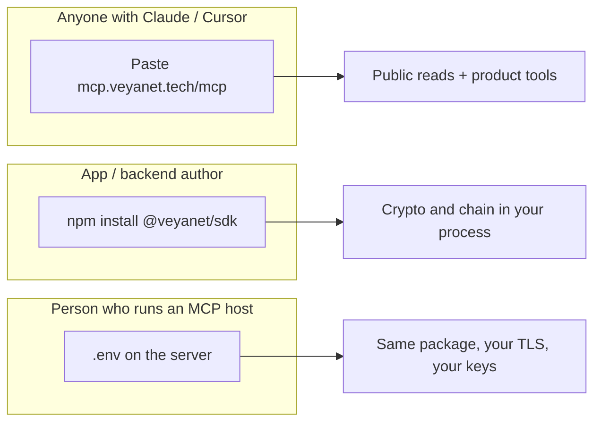
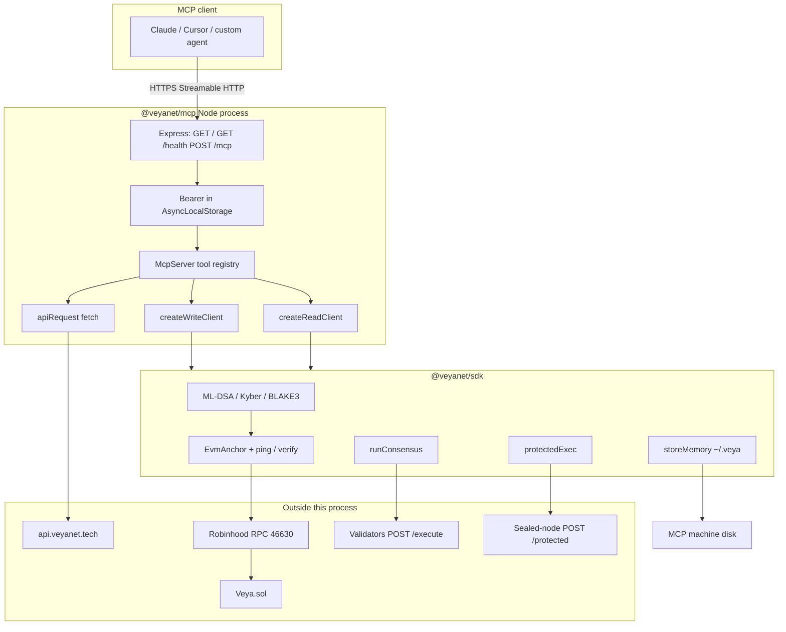
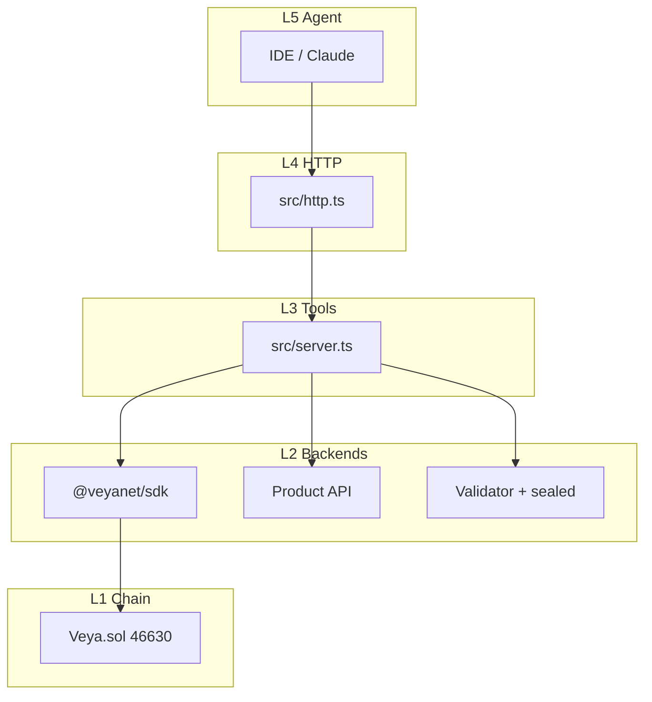
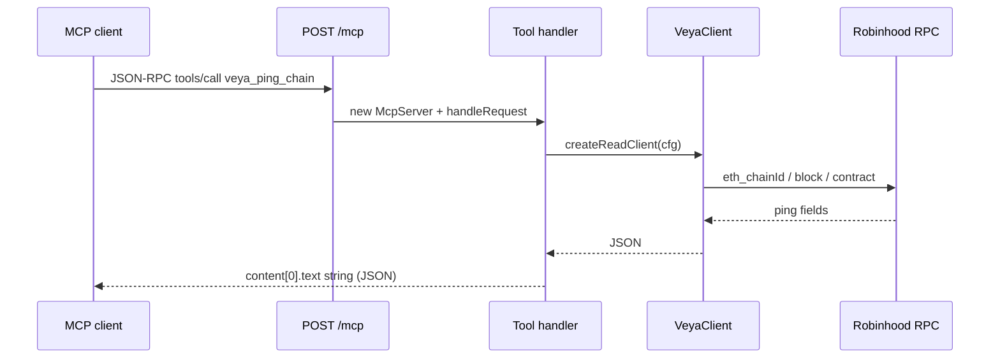
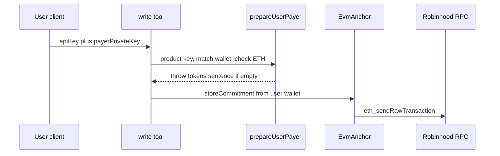
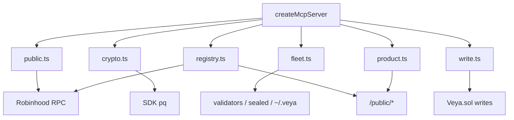
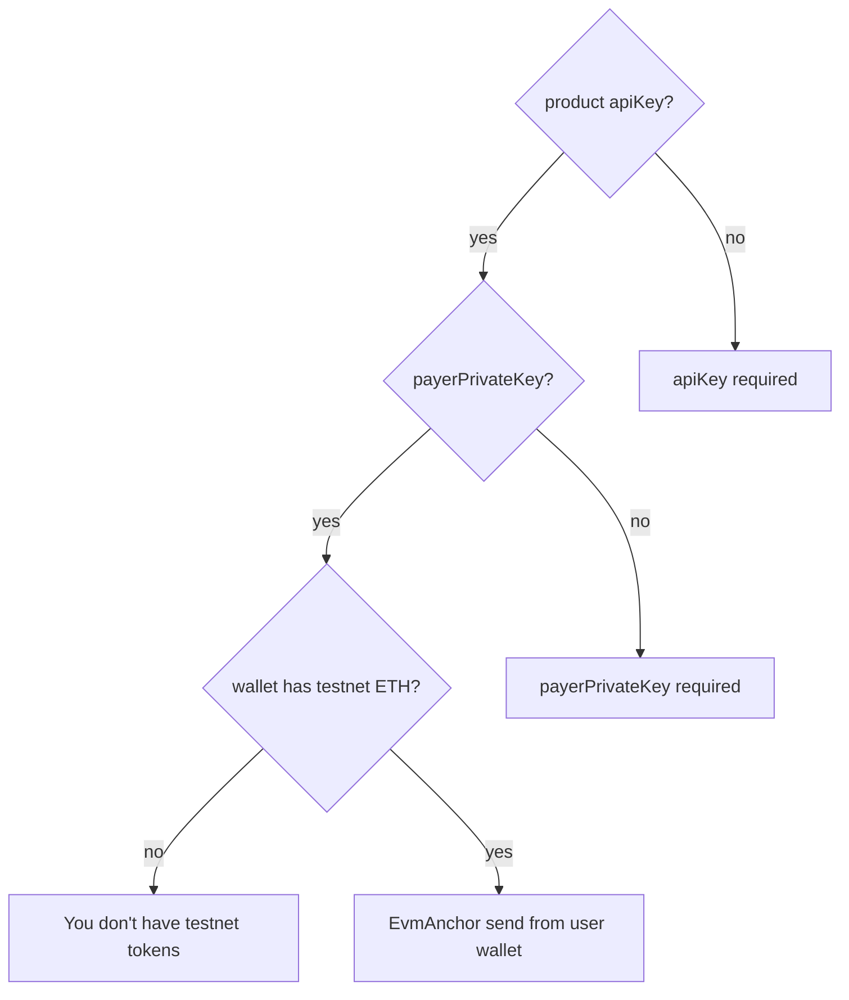

# System Architecture — `@veyanet/mcp`

**Thin HTTP gate. Thick cryptography lives in `@veyanet/sdk`. Product rooms live on `https://api.veyanet.tech`.**

This document explains how the MCP server is built, who talks to whom, and what a tool call actually does. Words stay simple. Details stay real.

[](../package.json)
[](https://explorer.testnet.chain.robinhood.com/address/0x1a1Dc3c55550FCE9F70ef6cDEeF967c0b72a5d84)
[](https://mcp.veyanet.tech/mcp)

**[Documentation Hub](./README.md)** • **[Tools](./TOOLS.md)** • **[Quickstart](./QUICKSTART.md)** • **[Network pin](./NETWORK_PIN.md)** • **[SDK bridge](./SDK_BRIDGE.md)**

---

## Table of contents

1. [What this package is](#1-what-this-package-is)
2. [Live public state](#2-live-public-state)
3. [Who uses which path](#3-who-uses-which-path)
4. [High-level picture](#4-high-level-picture)
5. [Layered architecture](#5-layered-architecture)
6. [Request lifecycle](#6-request-lifecycle)
7. [Component inventory](#7-component-inventory)
8. [How tools are grouped](#8-how-tools-are-grouped)
9. [Trust boundaries](#9-trust-boundaries)
10. [Secrets and write gating](#10-secrets-and-write-gating)
11. [Fleet and sealed capacity](#11-fleet-and-sealed-capacity)
12. [Product API vs MCP](#12-product-api-vs-mcp)
13. [Storage: what lives where](#13-storage-what-lives-where)
14. [Cryptographic profile](#14-cryptographic-profile)
15. [Failure modes](#15-failure-modes)
16. [Invariants](#16-invariants)
17. [Glossary](#17-glossary)

---

## 1. What this package is

`@veyanet/mcp` is a **Model Context Protocol** server. An MCP client (Claude, Cursor, or a custom agent) sends JSON-RPC over **Streamable HTTP**. The server turns those calls into:

| Job | Who actually does the work |
|-----|----------------------------|
| Hash, ping chain, verify a tx, PQ sign/verify, on-chain reads, optional on-chain writes | `@veyanet/sdk` inside this Node process |
| Guest login, rooms, agents, Use proofs, public registry | HTTPS to `https://api.veyanet.tech` |
| 2-of-3 consensus and AES sealed execute | SDK HTTP client → fleet URLs configured on **this** MCP host (on production, those URLs belong to the product API machine, not your laptop) |

Paste this URL into Claude or Cursor:

```text
https://mcp.veyanet.tech/mcp
```

Hashing, chain-id checks, and `Veya.sol` writes live in `@veyanet/sdk`. MCP registers tools and HTTP.

Live product facts:

| Topic | How it works today |
|-------|-------------------|
| Contract | `Veya.sol` is a protocol contract (commitments, environments, attestations). |
| Sealed path | **AES-256-GCM** on sealed-node (software process boundary). |
| Settlement | Robinhood **testnet 46630**. |
| Sessions | Product API keys (`veya_dev_` / `veya_live_`) come from the product site. MCP forwards `apiKey`. |
| Transport | `veya-mcp` is an **HTTP** Streamable HTTP server. |
| Quorum | Agreement is matching BLAKE3 hashes (2-of-3). Unreachable nodes return `consensus_reached: false`. |

---

## 2. Live public state

| Field | Value |
|-------|-------|
| npm package | `@veyanet/mcp` **1.2.1** |
| SDK it depends on | `@veyanet/sdk` **^1.2.1** |
| Public connector | `https://mcp.veyanet.tech/mcp` |
| Landing | `https://mcp.veyanet.tech/` |
| MCP health | `https://mcp.veyanet.tech/health` |
| Product API | `https://api.veyanet.tech` |
| Chain | Robinhood Chain testnet, id **46630** (`0xb636`) |
| Contract | `Veya.sol` at `0x1a1Dc3c55550FCE9F70ef6cDEeF967c0b72a5d84` |
| RPC | `https://rpc.testnet.chain.robinhood.com` |
| Explorer | `https://explorer.testnet.chain.robinhood.com` |
| Default Node listen | `0.0.0.0:8788` (behind TLS on the public host) |

A known testnet tx used in docs (sealed-execution commitment path):

```text
0xd68ab19671f0a3be63651cb6d6e24f5decf591da981708502827bca3689d31d8
```

Product API `/health` may say **`degraded`** when validators/sealed are not running on the API host. That is an honest fleet report. MCP describe and chain ping can still work.

---

## 3. Who uses which path



| Person | What they need |
|--------|----------------|
| Curious user | Public MCP URL. Optional: `veya_guest_login` for Use proofs. |
| TypeScript integrator | `@veyanet/sdk` from npm. MCP is optional. |
| Operator of `mcp.veyanet.tech` | This repo (or the npm binary), TLS, env pins, usually **writes off**. |
| Operator who wants chain writes from MCP | Product API key + **your** funded testnet wallet (`VEYA_PAYER_PRIVATE_KEY`). |

---

## 4. High-level picture



ASCII version of the same idea:

```text
MCP client (Claude / Cursor)
        │  TLS  POST /mcp
        ▼
┌───────────────────────────────────────────┐
│  @veyanet/mcp                             │
│  owns: HTTP, tool list, user-paid writes  │
│  does not own: crypto math, Veya.sol ABI  │
└───────────┬─────────────────┬─────────────┘
            │                 │
            │ SDK             │ fetch
            ▼                 ▼
   Robinhood RPC      api.veyanet.tech
   + local fleet URLs     rooms / guest / registry
   (on the API host)      + API-owned validators
```

---

## 5. Layered architecture

Each layer only talks to the layer below it for its job. MCP does not re-implement BLAKE3.

```
+------------------------------------------------------------------+
| L5  Agent / IDE                                                  |
|     Claude, Cursor, custom MCP client                            |
+--------------------------------+---------------------------------+
                                 | Streamable HTTP JSON-RPC
+--------------------------------v---------------------------------+
| L4  Transport                                                    |
|     Express JSON body (1 MB cap), CORS, GET /, GET /health       |
|     POST /mcp (stateless, one McpServer per request)             |
|     POST /mcp/session (optional MCP-Session-Id map)              |
+--------------------------------+---------------------------------+
                                 |
+--------------------------------v---------------------------------+
| L3  Tool policy                                                  |
|     registerPublic / crypto / fleet / registry / product / write |
|     product apiKey forwarded as X-Api-Key                        |
|     user-paid writes via EvmAnchor                               |
+--------------------------------+---------------------------------+
                                 |
          +----------------------+----------------------+
          |                      |                      |
+---------v---------+  +---------v---------+  +--------v----------+
| L2a SDK           |  | L2b Product HTTP  |  | L2c Fleet HTTP    |
| VeyaClient, pq,   |  | api.veyanet.tech  |  | validators        |
| EvmAnchor         |  | /v1 /public /auth |  | sealed-node       |
+---------+---------+  +---------+---------+  +--------+----------+
          |                      |                      |
          +----------------------+----------------------+
                                 |
+--------------------------------v---------------------------------+
| L1  Settlement                                                   |
|     Veya.sol on Robinhood testnet 46630                          |
+------------------------------------------------------------------+
```



---

## 6. Request lifecycle

### 6.1 Public read tool (example: `veya_ping_chain`)



No API key. No guest JWT. If RPC is down, the tool returns an error JSON (`isError: true` for SDK-backed tools that use `toolError`).

### 6.2 Product tool (example: `veya_list_environments`)

1. Client minted a product API key on the product site (or has a guest JWT for listing only).
2. Client passes `apiKey` as a **tool argument**.
3. `apiRequest` sets `X-Api-Key` toward `VEYA_API_URL` for product keys.
4. Guest JWT on create/deploy/write tools is refused by MCP. Mint a product key.

### 6.3 Write tool (example: `veya_store_commitment`)

Always registered. Needs product `apiKey` + the user's `payerPrivateKey`. `msg.sender` is the user.



### 6.4 Stateless vs session HTTP

| Path | Behavior |
|------|----------|
| `POST /mcp` | **Stateless.** New `McpServer` + Streamable HTTP transport per request. This is the public paste URL. |
| `POST /mcp/session` | Optional. Keeps transports in a `Map` keyed by `mcp-session-id`. Used if a client sends session ids. |

Landing `GET /` always advertises `https://mcp.veyanet.tech/mcp` (`CANONICAL_PUBLIC_MCP_URL`), even if the process is listening on another host. That is intentional so production never tells people to paste loopback.

---

## 7. Component inventory

Source of truth is this repo’s `src/` tree.

| File | What it does in plain words |
|------|-----------------------------|
| `src/cli.ts` | Starts the HTTP server (`veya-mcp` binary). |
| `src/index.ts` | Public Node exports: config, `createMcpServer`, `createHttpApp`. |
| `src/config.ts` | Reads env, default pins, `writesEnabled`. |
| `src/http.ts` | Express app, CORS, health, `/mcp`, `/mcp/session`, landing HTML. |
| `src/landingPage.ts` | HTML for `GET /`. Always shows the public paste URL. |
| `src/server.ts` | Builds `McpServer`, registers all tool groups. |
| `src/auth.ts` | Optional `Authorization: Bearer` parser (unused on the user-paid write path). |
| `src/sdk.ts` | `VeyaClient` factories + hex → bytes helper. |
| `src/api.ts` | `fetch` wrapper to the product API + JSON tool replies. |
| `src/tools/public.ts` | Describe, ping, hash, verify tx, API health. |
| `src/tools/crypto.ts` | PQ keygen / sign / verify. |
| `src/tools/fleet.ts` | Consensus, sealed, Boundnet in-process, local memory, PQ fingerprint. |
| `src/tools/registry.ts` | Public API explorer + on-chain `eth_call` reads. |
| `src/tools/product.ts` | Guest/session product API tools. |
| `src/tools/write.ts` | On-chain writes **or** `veya_writes_status`. |

Health JSON (`GET /health`) includes: `status`, `service` (`@veyanet/mcp`), `version`, `publicMcpUrl`, `chainId`, `contractAddress`, `writesEnabled`, `sealed` (`AES-256-GCM`), `settlement` (`Robinhood Chain testnet 46630`). Keys stay off this payload.

---

## 8. How tools are grouped

Full argument lists: [TOOLS.md](./TOOLS.md).



| Group | Auth on the MCP tool | Typical backend |
|-------|----------------------|-----------------|
| Public honesty | None | SDK + `GET {api}/health` |
| Crypto | None | SDK in this process |
| Fleet | None on MCP (fleet may still be unreachable) | SDK HTTP to configured node URLs |
| Registry | None | Product `/public/*` or SDK `eth_call` |
| Product | `apiKey` argument | Product `/auth`, `/v1`, `/api/verify` |
| Writes | `apiKey` + user payer | SDK `EvmAnchor` from the user's wallet |

Approximate count: **~49** tools. User-paid writes are always listed.

---

## 9. Trust boundaries

```text
┌─────────────────────────────────────────────────────────────┐
│  MCP Client                                                 │
│  Trusts: TLS to mcp.veyanet.tech, JSON tool text            │
│  Does not get: validator ports, hosted relayer key              │
└────────────────────────────┬────────────────────────────────┘
                             │ HTTPS
                             ▼
┌─────────────────────────────────────────────────────────────┐
│  MCP host                                                   │
│  Trusts: @veyanet/sdk, Robinhood RPC, product API TLS       │
│  Holds (optional): VEYA_PAYER_PRIVATE_KEY for self-host writes  │
│  May reach: 127.0.0.1:7701–7703 and :7800 IF it shares a    │
│  machine with the fleet (typical on the API host)           │
└───────────────┬─────────────────────────────┬───────────────┘
                │                             │
                ▼                             ▼
        Robinhood testnet              api.veyanet.tech
        (public RPC)                   (rooms, guest, registry)
```

### What a stranger can believe after `veya_verify_transaction`

- A receipt exists on chain 46630.
- Parsed `Veya.sol` events match what the SDK decoder says.

They still cannot treat that as “FHE ran” or “mainnet settled.”

### What guest JWT proves

- The product API issued a **Use-only** session (`POST /auth/guest`).
- It does **not** prove the caller owns a unique wallet.
- Build stays 403.

### Default loopback URLs (operators only)

`loadConfig()` defaults validators to `http://127.0.0.1:7701,7702,7703` and sealed to `http://127.0.0.1:7800`. That is so an MCP process **on the same host as the fleet** can reach it without extra env. It is **not** the stranger paste URL. Never put those loopback addresses in landing copy as “how to connect.”

---

## 10. Secrets and write gating



Payer keys must never appear in tool JSON, `/health`, or logs. Prefer `VEYA_PAYER_PRIVATE_KEY` on a self-hosted process.

Details: [AUTHENTICATION.md](./AUTHENTICATION.md).

---

## 11. Fleet and sealed capacity

Consensus and sealed-node are separate processes the **product API** (or a self-host operator) runs. They are outside the MCP npm tarball.

| Piece | HTTP | What “success” means |
|-------|------|----------------------|
| Validator | `POST /execute` | Node returns a BLAKE3 hash + ML-DSA sig of the payload |
| Quorum in SDK | — | At least **2 of 3** hashes **match**. No match → `consensus_reached: false` |
| Sealed-node | `POST /protected` | AES-256-GCM seal; MCP runs `requireVerifiedSeal` so `verified: false` cannot look like success |

If the MCP host’s `VEYA_VALIDATOR_NODES` still point at empty loopback, `veya_run_consensus` fails or reports no quorum.

Boundnet tools `veya_set_tool_policy` / `veya_route_message` use the **SDK in-process map**. Restarting MCP clears it. Hosted room policy is a **different** table on the product API (`veya_boundnet_invoke`).

Local memory tools write `~/.veya` on the **MCP machine**. That is not the console “My proofs” list.

---

## 12. Product API vs MCP

| Need | Use |
|------|-----|
| Agent paste URL | MCP |
| Human product console | `https://app.veyanet.tech` (product, not this package) |
| Guest stamp a text proof | Product console Use-mode. MCP `veya_anchor_proof` is user-paid and refuses guest. |
| TypeScript in your process | `@veyanet/sdk` |
| Create a Build room | Wallet session on the **API**, not guest |

MCP `apiRequest` timeout is **20 seconds**. `veya_api_health` uses **8 seconds**.

Guest is a **shared demo Use path**. It is not the official token-customer story.

---

## 13. Storage: what lives where

| Data | Where |
|------|-------|
| Tool registry | RAM, rebuilt every `POST /mcp` (stateless) |
| Optional MCP session transports | RAM `Map` on `/mcp/session` only |
| In-process Boundnet allow list | RAM in this Node process |
| Local agent memory | `~/.veya` on the MCP host |
| Guest proofs, rooms, public agents | Product API database |
| Commitments, environments, attestations | `Veya.sol` mappings on chain 46630 |
| Relayer key | Server env only |

Nothing in MCP persists guest JWTs.

---

## 14. Cryptographic profile

MCP does not pick algorithms. It calls the SDK.

| Primitive | Use in this stack |
|-----------|-------------------|
| BLAKE3-256 | Commitments, memory integrity, pubkey fingerprint |
| ML-DSA-44 (FIPS 204) | Agent/operator identity, validator signatures, secure-message sign |
| Kyber-768 (FIPS 203) | `veya_route_secure_message` session wrap |
| AES-256-GCM | Sealed-node payload seal (**not** FHE) |
| secp256k1 | User wallet `msg.sender` for `Veya.sol` gas (classical EVM) |

On-chain ML-DSA **verify** is not done inside the EVM. The chain stores hashes and optional signature bytes. Auditors verify with the SDK.

---

## 15. Failure modes

| What broke | What you see | What to do |
|------------|--------------|------------|
| MCP host down | Connector timeout | `curl https://mcp.veyanet.tech/health` |
| Robinhood RPC down | `veya_ping_chain` / verify fail | Check public RPC |
| Product API down | Guest, registry, proofs fail | `veya_api_health` |
| Product API `degraded` | Health body says validators/sealed unreachable | Fleet on the **API** host — MCP describe can still work |
| Validators down | `consensus_reached: false` or tool error | Do not treat as success |
| Sealed down | `veya_sealed_execute` / protected exec error | Fail closed |
| Guest + Build tool | MCP `isError` / product API 403 | Mint a product API key |
| Unfunded payer | Exact testnet-tokens sentence | Fund the wallet that minted the key |
| Wrong payer wallet | Does not match the API key wallet | Use the same wallet |
| Wrong chain id | SDK `CHAIN_MISMATCH` on writes | Pins must stay 46630 |

JSON body over **1 MB** is rejected by Express.

CORS: empty `CORS_ORIGIN` rejects **browser** `Origin` headers. Connectors with **no** Origin still work. That is why Claude/Cursor can call the public URL without a CORS allowlist.

---

## 16. Invariants

These must stay true in code and docs:

1. Public paste URL is `https://mcp.veyanet.tech/mcp`.
2. Settlement chain id is **46630** unless an operator deliberately self-hosts a different pin (then they must not call it “VEYA production”).
3. Sealed is **AES-256-GCM**.
4. `Veya.sol` is a protocol contract.
5. On-chain writes require a product API key and the user's funded wallet (`msg.sender` is the user).
6. Guest Build is **403**.
7. Unreachable quorum reports `consensus_reached: false`.
8. `/health` and `veya_describe` stay honest about testnet and sealed.
9. Keep `.env` and funded keys off git.
10. MCP uses `@veyanet/sdk` for crypto and chain writes.

---

## 17. Glossary

| Term | Meaning here |
|------|----------------|
| MCP | Model Context Protocol — JSON-RPC tools for agents |
| Streamable HTTP | MCP over `POST` + JSON or SSE, not stdio |
| Honesty card | `veya_describe` JSON (and `/health`) stating what is live |
| Product API | Hosted HTTP at `api.veyanet.tech` (rooms, guest, registry) |
| Fleet | Validator nodes + sealed-node owned by that API (or a self-host operator) |
| Boundnet | Deny-by-default tool routing between agents |
| Use | Guest-allowed product path (list/stamp proofs) |
| Build | Create rooms, deploy agents, protected exec — wallet, not guest |
| Relayer | Unused on the user-paid MCP write path. Gas is paid by the user's wallet. |
| Commitment | 32-byte digest stored on chain |
| Fail closed | Error or `false` instead of a fake success |

## Related docs

- [TOOLS.md](./TOOLS.md) — every tool in simple words  
- [TRANSPORT.md](./TRANSPORT.md) — HTTP endpoints and headers  
- [AUTHENTICATION.md](./AUTHENTICATION.md) — Bearer vs session  
- [CONFIGURATION.md](./CONFIGURATION.md) — env vars  
- [DEPLOYMENT.md](./DEPLOYMENT.md) — TLS host  
- [SDK_BRIDGE.md](./SDK_BRIDGE.md) — exact SDK imports  
- [NETWORK_PIN.md](./NETWORK_PIN.md) — chain constants  
- [VERIFICATION.md](./VERIFICATION.md) — how to prove it  
- [QUICKSTART.md](./QUICKSTART.md) — first five minutes  
