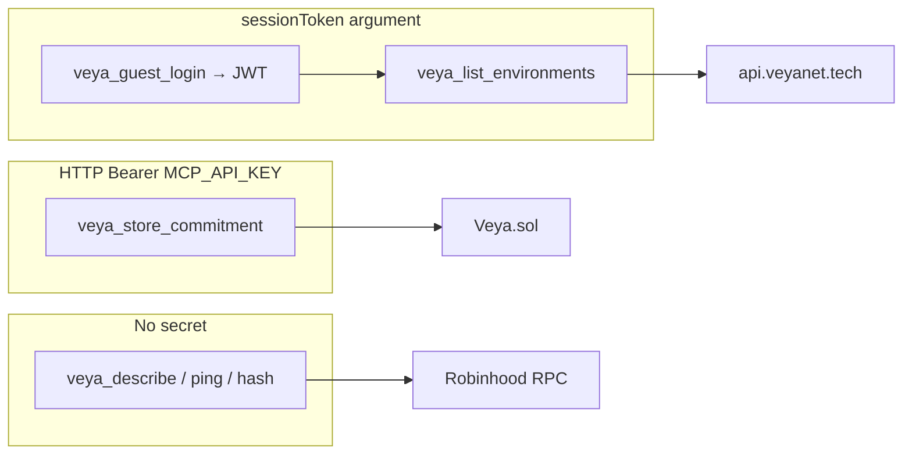
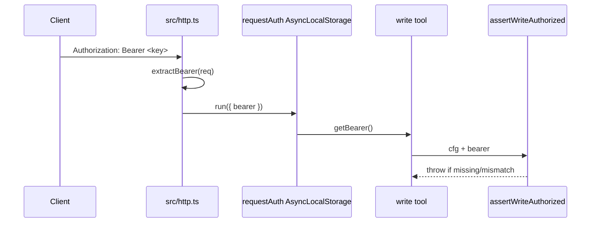

# Authentication & Writes — `@veyanet/mcp`

How this server decides who may **read**, who may use the **product API**, and who may **spend testnet gas** on `Veya.sol`.

Source of truth: `src/auth.ts`, `src/http.ts` (Bearer into `AsyncLocalStorage`), `src/tools/write.ts`, `src/tools/product.ts`.

**[Architecture](./ARCHITECTURE.md)** • **[Tools](./TOOLS.md)** • **[Configuration](./CONFIGURATION.md)** • **[Security](../SECURITY.md)**

---

## Table of contents

1. [Three keys, three jobs](#1-three-keys-three-jobs)
2. [Public tools](#2-public-tools)
3. [Product session (`sessionToken`)](#3-product-session-sessiontoken)
4. [Guest vs wallet](#4-guest-vs-wallet)
5. [On-chain writes (HTTP Bearer)](#5-on-chain-writes-http-bearer)
6. [How Bearer is wired](#6-how-bearer-is-wired)
7. [Enabling and disabling writes](#7-enabling-and-disabling-writes)
8. [Client headers](#8-client-headers)
9. [Key custody](#9-key-custody)
10. [Recommended production posture](#10-recommended-production-posture)
11. [Failure messages you will see](#11-failure-messages-you-will-see)
12. [Related reading](#12-related-reading)

---

## 1. Three keys, three jobs

People mix these up. They are not interchangeable.

| Secret / token | Who issues it | Where it is sent | What it unlocks |
|----------------|---------------|------------------|-----------------|
| Nothing | — | — | Describe, ping, hash, verify tx, PQ crypto, public registry, API health, fleet tools (fleet may still be down) |
| `sessionToken` | Product API (`/auth/guest` or wallet `/auth/verify`) | Tool **argument** → MCP → `Authorization` toward `api.veyanet.tech` | Rooms, proofs, Build (wallet only) |
| `MCP_API_KEY` | You, on the **MCP host** `.env` | HTTP header `Authorization: Bearer` on `POST /mcp` | On-chain write tools on **that** MCP process |
| Relayer private key | You, on the MCP host `.env` | Never sent to the client | Pays gas as `msg.sender` on Robinhood testnet |



If you put `MCP_API_KEY` in `sessionToken`, the product API will reject it. If you put a guest JWT in the MCP `Authorization` header, write tools will not accept it (unless you foolishly set `MCP_API_KEY` to that JWT — do not).

---

## 2. Public tools

These tools run for anyone who can reach the MCP URL:

- Honesty: `veya_describe`, `veya_ping_chain`, `veya_hash_blake3`, `veya_verify_transaction`, `veya_api_health`
- Writes-off banner: `veya_writes_status` (only when writes are disabled)
- PQ: `veya_pq_keygen`, `veya_pq_sign`, `veya_pq_verify`, `veya_pq_fingerprint`
- Fleet / Boundnet / local memory (still fail closed if nodes are down)
- Public registry and on-chain **reads**
- `veya_verify_proof_api` (public product verify path)

`GET /` and `GET /health` also have no auth. Health never prints keys.

Public MCP clients talk to `https://mcp.veyanet.tech`. The MCP process may call loopback fleet URLs when it shares a machine with the API.

---

## 3. Product session (`sessionToken`)

Product tools take an optional Zod string `sessionToken` (minimum 10 characters). If it is missing, the handler returns JSON `{ "error": "sessionToken required" }` instead of calling the API (except `veya_guest_login` and `veya_verify_proof_api`).

`src/api.ts` then sends:

```http
Authorization: Bearer <sessionToken>
Accept: application/json
```

to `{VEYA_API_URL}` (default `https://api.veyanet.tech`). Timeout: 20 seconds.

MCP does **not** log in with a wallet popup. Wallet login is:

1. Product API `GET /auth/nonce`
2. User signs the nonce in a wallet (console or your app)
3. `POST /auth/verify` → JWT
4. You pass that JWT into MCP as `sessionToken`

---

## 4. Guest vs wallet

`veya_guest_login` calls `POST /auth/guest` with **no** session. The API returns a JWT for **Use-only**.

| Action | Guest JWT | Wallet JWT |
|--------|-----------|------------|
| List showcase / Use environments | Yes (scoped) | Yes |
| List / anchor content proofs | Yes (API caps + relayer gas) | Yes |
| Create environment | **403** | Yes |
| Deploy agent | **403** | Yes |
| Protected execution | **403** | Yes |
| Boundnet invoke (Build) | **403** | Policy + allowlist |

403 is **product policy**, not an MCP crash. MCP forwards the API status in `httpStatus` + `body`.

Guest is a **shared demo** session. The wallet label you see is often the **API relayer**, not “your” unique account. Do not treat guest as the official token customer.

---

## 5. On-chain writes (HTTP Bearer)

Write tools talk to `Veya.sol` through `@veyanet/sdk` `EvmAnchor`. They spend **testnet ETH** from the relayer. They are a different path from guest `veya_anchor_proof` (which uses the **product API** relayer).

Registered only when **both** are set:

```bash
MCP_API_KEY=...                      # shared secret callers must send
VEYA_RELAYER_PRIVATE_KEY=0x...       # pays gas
# or VEYA_DEPLOYER_PRIVATE_KEY=0x... # accepted as the same payer
```

`writesEnabled(cfg)` in `src/config.ts` is `Boolean(mcpApiKey && relayerPrivateKey)`.

If false:

- The five write tools are **not** registered
- `veya_writes_status` is registered instead, with reason text telling the operator to set those two env vars

If true, every write handler still calls `assertWriteAuthorized` so a client without the header cannot write.

Write tools:

| Tool | Solidity-ish job |
|------|------------------|
| `veya_store_commitment` | `storeCommitment` |
| `veya_attest_execution` | `attestExecution` |
| `veya_register_environment` | `registerEnvironment` |
| `veya_register_pq_onchain` | SDK helper: keygen + register + companion commitment |
| `veya_anchor_pq_attestation` | `anchorPqAttestation` |

`veya_register_pq_onchain` returns public key hex/hash and tx hashes. It does **not** put the ML-DSA private key in that JSON (custody stays in the SDK call on the server — do not log it).

SDK writes still call `ensureRobinhoodChain()`. Wrong `eth_chainId` → fail closed.

---

## 6. How Bearer is wired



`extractBearer` reads `Authorization` or `authorization`. Pattern: `Bearer <token>` (case-insensitive scheme).

Compare is **ordinary string `!==`**, not constant-time. Use a long random key. Rotate if it leaks.

If the key is unset on the server, assert throws *Write tools disabled…* even if someone sends a Bearer.

---

## 7. Enabling and disabling writes

| MCP_API_KEY | Relayer key | Tool surface |
|-------------|-------------|--------------|
| empty | empty | `veya_writes_status` |
| set | empty | `veya_writes_status` |
| empty | set | `veya_writes_status` |
| set | set | Five write tools, each still needs matching Bearer |

Public `mcp.veyanet.tech` should stay on the first row. Writes belong on a **private** MCP instance (VPN, IP allowlist, or not published).

---

## 8. Client headers

MCP clients differ. Raw HTTP for an operator test:

```http
POST /mcp HTTP/1.1
Host: mcp.veyanet.tech
Authorization: Bearer <MCP_API_KEY>
Content-Type: application/json
Accept: application/json, text/event-stream
```

`Accept` should allow JSON **and** SSE because Streamable HTTP may return either.

If Claude/Cursor cannot attach a custom header, **do not** enable writes on the public URL. Run a second MCP host for writers.

Product tools do **not** use this header. They use the `sessionToken` field inside `tools/call` arguments.

---

## 9. Key custody

| Secret | Lives | Never |
|--------|-------|-------|
| `MCP_API_KEY` | Server `.env` / secret manager | git, README, screenshots, `/health` |
| Relayer / deployer hex key | Same | logs, tool responses, landing HTML |
| Guest / wallet JWT | Client memory; MCP does not store it | Treating guest JWT as a unique human id |
| ML-DSA private keys from `veya_pq_keygen` | Returned to the **caller** | Public chats, git |

`.env.example` is allowed in git. Real `.env` is not.

Fund the relayer with **little** testnet ETH. Watch the explorer for unexpected txs.

---

## 10. Recommended production posture

1. Public MCP → **reads + product tools**, writes **off**.
2. Private operator MCP → writes on, dedicated testnet wallet, forwarded `Authorization` through nginx/Caddy.
3. Rate-limit `/mcp` at the proxy before you ever enable public writes.
4. Rotate `MCP_API_KEY` if any authorized client is lost.
5. Keep `PUBLIC_MCP_URL=https://mcp.veyanet.tech/mcp` so landing never advertises a private bind address.

---

## 11. Failure messages you will see

| Situation | Typical result |
|-----------|----------------|
| Writes off | Tool `veya_writes_status` with `writesEnabled: false` |
| Writes on, no/wrong Bearer | `{ "error": "Unauthorized: provide Authorization: Bearer <MCP_API_KEY>" }` |
| Writes on, Bearer ok, no relayer (should not register, but assert still checks) | Relayer not configured |
| Guest + create environment | Product `httpStatus: 403` |
| Missing `sessionToken` | `{ "error": "sessionToken required" }` |
| Wrong chain | SDK chain mismatch on send |

---

## 12. Related reading

- How to add a tool: [CONTRIBUTING.md](../CONTRIBUTING.md)
- Chain constants: [NETWORK_PIN.md](./NETWORK_PIN.md)
- SDK crypto and writes: [SDK_BRIDGE.md](./SDK_BRIDGE.md)
