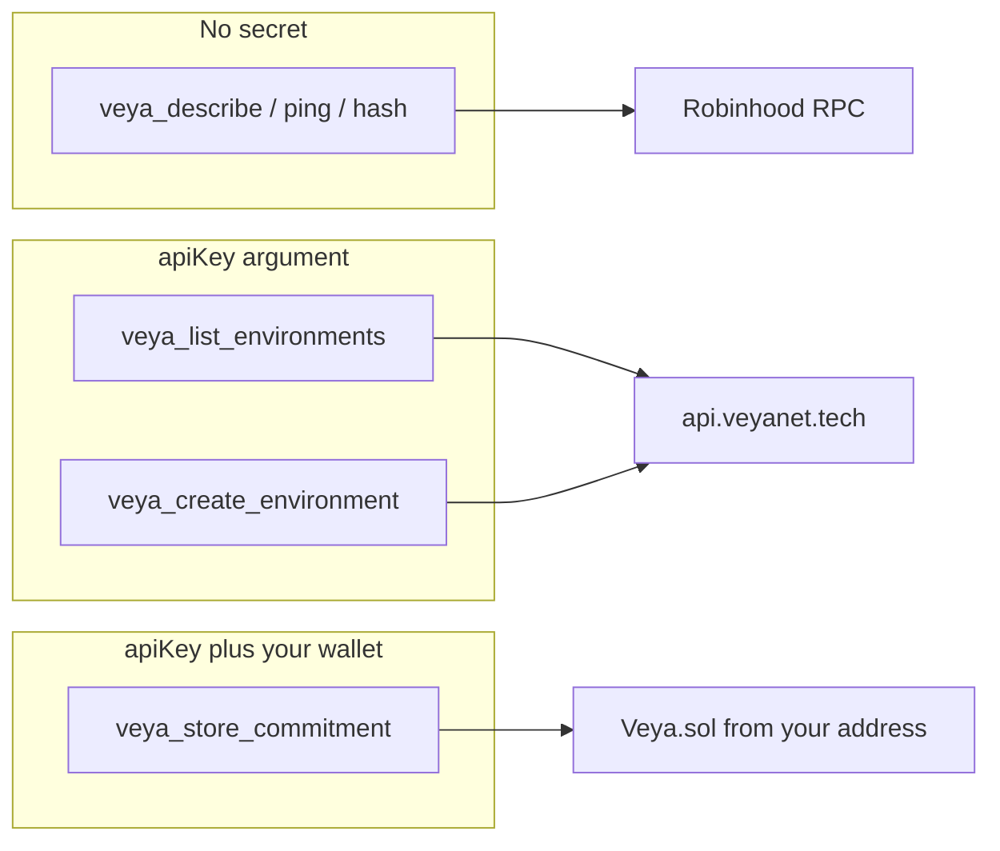

# Authentication & Writes — `@veyanet/mcp`

How this server decides who may **read**, who may use the **product API**, and who pays **gas** on `Veya.sol`.

**[Architecture](./ARCHITECTURE.md)** • **[Tools](./TOOLS.md)** • **[Configuration](./CONFIGURATION.md)** • **[Security](../SECURITY.md)**

---

## Table of contents

1. [Three credentials, three jobs](#1-three-credentials-three-jobs)
2. [Public tools](#2-public-tools)
3. [Product API key](#3-product-api-key)
4. [Guest vs wallet](#4-guest-vs-wallet)
5. [On-chain writes (your wallet)](#5-on-chain-writes-your-wallet)
6. [No testnet tokens](#6-no-testnet-tokens)
7. [Where to put the private key](#7-where-to-put-the-private-key)
8. [Failure messages](#8-failure-messages)
9. [Related reading](#9-related-reading)

---

## 1. Three credentials, three jobs

People mix these up. They are not interchangeable.

| Secret | Who issues it | Where it is sent | What it unlocks |
|--------|---------------|------------------|-----------------|
| Nothing | — | — | Describe, ping, hash, verify tx, PQ crypto, public registry, API health |
| Product API key (`veya_dev_…` / `veya_live_…`) | Product site, after wallet login | Tool argument `apiKey` → MCP → `X-Api-Key` toward `api.veyanet.tech` | Rooms, proofs list, Build on the product API |
| Your wallet private key | You | Tool argument `payerPrivateKey` or env `VEYA_PAYER_PRIVATE_KEY` | On-chain writes. `msg.sender` is **your** address |

The hosted relayer is **not** the gas payer for API-key writes. If you use a product API key, the transaction is from your wallet. You need Robinhood testnet ETH.



---

## 2. Public tools

These tools run for anyone who can reach the MCP URL:

- Honesty: `veya_describe`, `veya_ping_chain`, `veya_hash_blake3`, `veya_verify_transaction`, `veya_api_health`
- `veya_writes_status` (explains user-paid writes)
- PQ: `veya_pq_keygen`, `veya_pq_sign`, `veya_pq_verify`, `veya_pq_fingerprint`
- Fleet / Boundnet / local memory (still fail closed if nodes are down)
- Public registry and on-chain **reads**
- `veya_verify_proof_api`

`GET /` and `GET /health` also have no auth. Health never prints keys.

---

## 3. Product API key

Mint the key on the product site (wallet login). Guests **cannot** mint keys.

Pass it as the tool argument `apiKey`. MCP forwards product keys as:

```http
X-Api-Key: veya_dev_…
Authorization: Bearer veya_dev_…
```

to `https://api.veyanet.tech`.

If `apiKey` is missing, product tools return `{ "error": "apiKey required" }` instead of calling the API (except `veya_guest_login` and `veya_verify_proof_api`).

`veya_account` asks the product API for the wallet bound to that key. On-chain writes refuse a `payerPrivateKey` whose address does not match that wallet.

---

## 4. Guest vs wallet

`veya_guest_login` still exists for **Use listing**. The JWT is not a write credential.

| Action | Guest JWT | Product API key |
|--------|-----------|-----------------|
| List showcase / Use environments | Yes (scoped) | Yes |
| Create environment (API row) | Refused by MCP | Yes |
| Deploy agent / protected execution | Refused by MCP / API 403 | Yes |
| On-chain write | Refused. Mint a product API key and fund your wallet. | Yes, from **your** wallet |

Creating an environment in the product API does **not** spend gas. Registering that room on `Veya.sol` does.

---

## 5. On-chain writes (your wallet)

Write tools talk to `Veya.sol` through `@veyanet/sdk` `EvmAnchor`. They spend **your** testnet ETH.

Every write still:

1. Requires a product `apiKey`
2. Resolves `payerPrivateKey` (tool arg or `VEYA_PAYER_PRIVATE_KEY`)
3. Checks that the payer address matches the wallet on that API key
4. Checks the wallet has a non-zero ETH balance
5. Sends the tx; `from` in the tool result is your address

Write tools:

| Tool | Job |
|------|-----|
| `veya_store_commitment` | `storeCommitment` |
| `veya_attest_execution` | `attestExecution` |
| `veya_register_environment` | `registerEnvironment` (optional product `environmentId` then confirm on the product API) |
| `veya_register_pq_onchain` | SDK helper: keygen + register + companion commitment |
| `veya_anchor_pq_attestation` | `anchorPqAttestation` |
| `veya_anchor_proof` | BLAKE3 of label+content, then `storeCommitment` from your wallet |

SDK writes still call `ensureRobinhoodChain()`. Wrong `eth_chainId` → fail closed.

---

## 6. No testnet tokens

If the wallet balance is `0`, or the node returns insufficient funds, the tool returns exactly:

```text
You don't have testnet tokens. Please get them for the transaction.
```

Fund the **same** address that minted the API key, on Robinhood Chain testnet (chain id **46630**), using https://faucet.testnet.chain.robinhood.com/

---

## 7. Where to put the private key

Prefer a **self-hosted** `veya-mcp` with env:

```bash
VEYA_PAYER_PRIVATE_KEY=0x…
```

so the agent does not paste the key into a tool argument.

If you pass `payerPrivateKey` to the **public** HTTP URL, that host holds the key for the duration of the call. Do not use a mainnet key. Testnet only.

Never log, screenshot, or commit the key. MCP does not put it in `/health`, landing HTML, or tool success payloads.

---

## 8. Failure messages

| Situation | Typical result |
|-----------|----------------|
| Missing `apiKey` | `{ "error": "apiKey required" }` |
| Guest JWT on a write tool | Mint a product API key on the product site and fund your wallet. |
| Missing payer | `payerPrivateKey required` |
| Payer ≠ API key wallet | payerPrivateKey does not match the wallet on this API key |
| Empty / unfunded wallet | `You don't have testnet tokens. Please get them for the transaction.` |
| Guest + create environment | MCP `isError` (mint a product API key) |
| Wrong chain | SDK chain mismatch on send |

---

## 9. Related reading

- Tool catalog: [TOOLS.md](./TOOLS.md)
- Chain constants: [NETWORK_PIN.md](./NETWORK_PIN.md)
- SDK crypto and writes: [SDK_BRIDGE.md](./SDK_BRIDGE.md)
