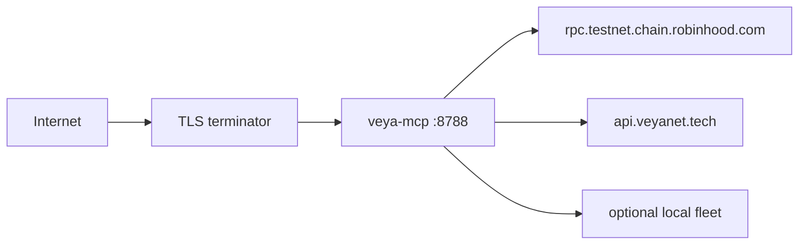

# Deployment Guide — `@veyanet/mcp`

How to run the MCP Node process behind TLS so agents can paste a public HTTPS URL.

**Public paste URL:** `https://mcp.veyanet.tech/mcp`  
**Product API:** `https://api.veyanet.tech`  
**npm:** `@veyanet/mcp@1.2.2`

Strangers only need that paste URL (and optionally `@veyanet/sdk`). This guide is for the person who operates the host.

**[Configuration](./CONFIGURATION.md)** • **[Authentication](./AUTHENTICATION.md)** • **[Transport](./TRANSPORT.md)** • **[Architecture](./ARCHITECTURE.md)**

---

## Table of contents

1. [What you are deploying](#1-what-you-are-deploying)
2. [Where the rest of the stack runs](#2-where-the-rest-of-the-stack-runs)
3. [Architecture on the host](#3-architecture-on-the-host)
4. [Install and build](#4-install-and-build)
5. [Required production env](#5-required-production-env)
6. [Reverse proxy](#6-reverse-proxy)
7. [Process manager](#7-process-manager)
8. [Health and landing checks](#8-health-and-landing-checks)
9. [Writes: public vs private instance](#9-writes-public-vs-private-instance)
10. [Fleet on the same machine](#10-fleet-on-the-same-machine)
11. [Secrets](#11-secrets)
12. [Rollback](#12-rollback)

---

## 1. What you are deploying

A Node 20+ HTTP server (`veya-mcp` / `node dist/cli.js`) that:

- Serves `GET /`, `GET /health`, `POST /mcp`
- Registers MCP tools
- Calls `@veyanet/sdk` and `https://api.veyanet.tech`

This package is the MCP HTTP process.

---

## 2. Where the rest of the stack runs

| Component | Where it lives |
|-----------|----------------|
| Product REST + database | API host (`api.veyanet.tech`) |
| validator-node ×3 | API host / private fleet (defaults `7701–7703` if colocated) |
| sealed-node | API host / private fleet (default `7800`) |
| Chain | Robinhood public testnet |

If you only deploy MCP and the API fleet is down, describe/ping/verify can still work; consensus/sealed/guest Build paths follow the API and fleet.

---

## 3. Architecture on the host

```text
Internet
   │ TLS (Let’s Encrypt / your cert)
   ▼
Reverse proxy (nginx, Caddy, Traefik)
   │ HTTP to 127.0.0.1:8788
   │ Forward Authorization
   ▼
Node @veyanet/mcp
   │
   ├── Robinhood RPC (public)
   ├── api.veyanet.tech (HTTPS)
   └── optional: 127.0.0.1:7701–7703 / 7800 if fleet is local
```



Never publish the private bind address as the product paste URL. Always:

```bash
PUBLIC_MCP_URL=https://mcp.veyanet.tech/mcp
VEYA_API_URL=https://api.veyanet.tech
```

Landing HTML already forces the canonical public MCP URL. Keep health `publicMcpUrl` the same.

---

## 4. Install and build

From npm:

```bash
npm install -g @veyanet/mcp
veya-mcp
```

From this git checkout:

```bash
npm install
npm run build
npm test
npm run smoke
node dist/cli.js
```

Copy `.env.example` → `.env` on the **server only**. The CLI does not auto-load `.env`; export variables in systemd/docker.

---

## 5. Required production env

Minimum for a **public** host (reads free; user-paid writes use the caller's key + wallet):

```bash
NODE_ENV=production
HOST=127.0.0.1
PORT=8788
PUBLIC_MCP_URL=https://mcp.veyanet.tech/mcp
VEYA_API_URL=https://api.veyanet.tech
ROBINHOOD_CHAIN_ID=46630
ROBINHOOD_RPC_URL=https://rpc.testnet.chain.robinhood.com
ROBINHOOD_EXPLORER_URL=https://explorer.testnet.chain.robinhood.com
VEYA_CONTRACT_ADDRESS=0x1a1Dc3c55550FCE9F70ef6cDEeF967c0b72a5d84
# Leave MCP_API_KEY and VEYA_RELAYER_PRIVATE_KEY empty
```

`HOST=127.0.0.1` is safer than `0.0.0.0` if the proxy sits on the same machine. Code default is `0.0.0.0` so Docker-style binds work; prefer loopback + proxy when you can.

If this MCP process **is** on the API box and validators listen locally, you can leave fleet defaults. If not, set `VEYA_VALIDATOR_NODES` and `VEYA_SEALED_NODE_URL` to the private fleet URLs. See [CONFIGURATION.md](./CONFIGURATION.md).

Optional browser CORS:

```bash
CORS_ORIGIN=https://veyanet.tech,https://www.veyanet.tech,https://app.veyanet.tech
```

---

## 6. Reverse proxy

Requirements:

1. TLS 1.2+ for `mcp.veyanet.tech`
2. Forward `POST /mcp`, `GET /`, `GET /health` (and `/mcp/session` if you use it)
3. Forward header `Authorization` (needed only if writes are on)
4. Do not buffer SSE to death — Streamable HTTP may use `text/event-stream`. Disable proxy buffering for `/mcp` if clients hang.
5. Reasonable body size ≥ 1 MB (Express cap is 1 MB anyway)

Sketch (nginx concepts, not a copy-paste production file):

- `proxy_pass` to `http://127.0.0.1:8788`
- `proxy_http_version 1.1`
- `proxy_set_header Authorization $http_authorization`
- `proxy_buffering off` on `/mcp`

HTTP/2 at the edge is fine if your client stack allows it; MCP clients vary.

---

## 7. Process manager

Run under systemd, Docker, or similar:

- Restart on crash
- Do not log env that contains keys
- `chmod 600` on `.env` if you use a file

Docker: pass env with `--env-file` that is **not** in the image. Do not bake keys into layers.

---

## 8. Health and landing checks

After deploy:

```bash
curl -sS https://mcp.veyanet.tech/health
curl -sS -o /dev/null -w "%{http_code}\n" https://mcp.veyanet.tech/
curl -sS https://api.veyanet.tech/health
```

Require MCP health:

- `service` = `@veyanet/mcp`
- `chainId` = `46630`
- `sealed` mentions `AES-256-GCM`
- `writesEnabled` = `true` (user-paid write tools; `operatorRelayerWrites` is `false`)
- `publicMcpUrl` = `https://mcp.veyanet.tech/mcp`

Landing must tell humans to paste `https://mcp.veyanet.tech/mcp`.

API health may be `degraded` if validators/sealed are down on the API host. MCP can still be `ok`.

Then connect a real MCP client and call `veya_describe` + `veya_ping_chain`. See [VERIFICATION.md](./VERIFICATION.md).

---

## 9. Writes: public vs private instance

| Host | Writes |
|------|--------|
| `mcp.veyanet.tech` | User-paid writes (product `apiKey` + **user** wallet). Hosted relayer off. |
| Self-hosted MCP | Same, with `VEYA_PAYER_PRIVATE_KEY` in env so the key is not a tool argument |

Do not put a hosted relayer key on the public URL. Guest listing still works. On-chain stamps from MCP spend the user's testnet ETH.

---

## 10. Fleet on the same machine

If you colocated MCP with validators:

- Validators: `POST /execute` on `7701–7703`
- Sealed: `POST /protected` on `7800`
- Do not open those ports on the public firewall. Only Node on localhost should call them.

Strangers never curl those ports.

---

## 11. Secrets

Never git:

- `.env`
- funded keys
- `MCP_API_KEY`

`.env.example` is the only template. See [SECURITY.md](../SECURITY.md).

---

## 12. Rollback

Keep the previous `dist/` or npm version. This package has no database. Rollback = restart old binary + same env.

Chain state is on Robinhood testnet and is **not** rolled back with MCP.

Related: [NETWORK_PIN.md](./NETWORK_PIN.md), [QUICKSTART.md](./QUICKSTART.md).
