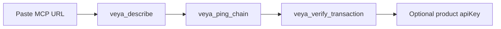

# Quickstart Guide — `@veyanet/mcp`

From zero to a verified chain ping using **public** VEYA surfaces: the paste URL, optional `@veyanet/sdk`, and `https://api.veyanet.tech`.

**[Tools](./TOOLS.md)** • **[Architecture](./ARCHITECTURE.md)** • **[Network pin](./NETWORK_PIN.md)** • **[Verification](./VERIFICATION.md)**

---

## Table of contents

1. [What you will use](#1-what-you-will-use)
2. [Part 1 — Connect the public MCP](#2-part-1--connect-the-public-mcp)
3. [Part 2 — Optional guest Use path](#3-part-2--optional-guest-use-path)
4. [Part 3 — TypeScript SDK](#4-part-3--typescript-sdk)
5. [What consensus and sealed mean for you](#5-what-consensus-and-sealed-mean-for-you)
6. [Optional: run the HTTP binary yourself](#6-optional-run-the-http-binary-yourself)
7. [If something fails](#7-if-something-fails)
8. [Next reading](#8-next-reading)

---

## 1. What you will use

| Surface | URL / package |
|---------|----------------|
| Public MCP | `https://mcp.veyanet.tech/mcp` |
| MCP health | `https://mcp.veyanet.tech/health` |
| Product API | `https://api.veyanet.tech` |
| TypeScript library | `@veyanet/sdk` on npm |

You need Node only if you install the SDK. Claude/Cursor users need no key to **read**. Product writes need a site API key. On-chain writes need **your** testnet ETH.



---

## 2. Part 1 — Connect the public MCP

### Step 1 — Add the connector

In Claude or Cursor, add a custom MCP server with **Streamable HTTP** (not stdio):

```text
https://mcp.veyanet.tech/mcp
```

Optional check in a terminal:

```bash
curl -s https://mcp.veyanet.tech/health
```

You want `service` = `@veyanet/mcp`, `chainId` = `46630`, `sealed` mentioning AES-256-GCM.

### Step 2 — Honesty card

Ask the agent:

> Call `veya_describe` and summarize settlement, sealed, and whether writes are on.

You should see:

- Package `@veyanet/mcp`
- Chain id **46630**
- Contract `0x1a1Dc3c55550FCE9F70ef6cDEeF967c0b72a5d84`
- Sealed = **AES-256-GCM**
- Settlement = Robinhood testnet **46630**
- Writes need a product API key **and your funded wallet** (not the hosted relayer)
- Fleet belongs to the product API; unreachable capacity fails closed

### Step 3 — Live chain ping

> Call `veya_ping_chain`.

Confirm chain id **46630** and a block number. If this fails, later verify/write will fail too — RPC or pin problem.

### Step 4 — Verify a real transaction

> Call `veya_verify_transaction` with  
> `0xd68ab19671f0a3be63651cb6d6e24f5decf591da981708502827bca3689d31d8`

Expect parsed `Veya.sol` events (for example `CommitmentStored`) and a digest. Open the Robinhood testnet explorer and match the `to` address to the contract.

This proves a commitment landed. It does **not** prove FHE.

### Step 5 — Product API health

> Call `veya_api_health`.

This is `GET https://api.veyanet.tech/health`. A **`degraded`** body usually means validators/sealed are not running on the API host. That is honest. MCP describe/ping can still work.

---

## 3. Part 2 — Product API key (writes)

Mint `veya_dev_…` or `veya_live_…` on the product site after wallet login. Guests cannot mint keys.

> Call `veya_list_environments` with `apiKey` set to that key.

Create environment is an API row (no gas). On-chain writes (`veya_store_commitment`, `veya_register_environment`, `veya_anchor_proof`) need the same key **plus** your wallet private key (`payerPrivateKey` or `VEYA_PAYER_PRIVATE_KEY` on a self-hosted MCP).

If the wallet has no ETH:

```text
You don't have testnet tokens. Please get them for the transaction.
```

`veya_guest_login` still lists Use rooms. Guest is **not** a write credential.

To Build rooms you need a **product API key** from a wallet login. MCP has no wallet popup.

---

## 4. Part 3 — TypeScript SDK

If you are writing a backend or script:

```bash
npm install @veyanet/sdk
```

```ts
import { VeyaClient } from "@veyanet/sdk";

const client = new VeyaClient({
  // defaults: Robinhood testnet 46630 + public Veya.sol
});

const ping = await client.pingChain();
console.log(ping.chainId.toString()); // "46630"
```

MCP remains the paste-URL agent surface. The SDK is crypto + chain in **your** process.

---

## 5. What consensus and sealed mean for you

Tools like `veya_run_consensus` and `veya_sealed_execute` exist on the public MCP. They call **fleet URLs configured on the MCP host**. On production those should be the API-owned validators/sealed-node.

If that fleet is down, you get an error or `consensus_reached: false`.

Sealed = **AES-256-GCM**. The public paste URL is `https://mcp.veyanet.tech/mcp`.

---

## 6. Optional: run the HTTP binary yourself

Only if you **operate** a host. Strangers should stay on `https://mcp.veyanet.tech/mcp`.

```bash
npm install -g @veyanet/mcp
veya-mcp
# or: npx -y @veyanet/mcp
```

This starts **Streamable HTTP** on `PORT` (default 8788). Point a local client at `http://127.0.0.1:8788/mcp` for your own tests. After TLS, advertise the public HTTPS URL. See [DEPLOYMENT.md](./DEPLOYMENT.md) and [CONFIGURATION.md](./CONFIGURATION.md).

Set `VEYA_PAYER_PRIVATE_KEY` to **your** testnet wallet if this process will send chain writes. Prefer that over pasting the key into a tool argument.

---

## 7. If something fails

| Symptom | Likely cause |
|---------|----------------|
| Connector timeout | MCP host / TLS |
| Health ok, ping fails | Robinhood RPC |
| Describe ok, guest fails | Product API |
| API health `degraded` | Fleet on API host |
| Create environment refused | Guest JWT is not a product API key |
| Write: apiKey required | Pass `veya_dev_` / `veya_live_` from the product site |
| Write: no testnet tokens | Fund **your** wallet on Robinhood testnet 46630 |

More: [VERIFICATION.md](./VERIFICATION.md).

---

## 8. Next reading

- [TOOLS.md](./TOOLS.md) — every tool, arguments, what it does **not** do  
- [ARCHITECTURE.md](./ARCHITECTURE.md) — pictures of layers and trust  
- [NETWORK_PIN.md](./NETWORK_PIN.md) — chain constants  
- [AUTHENTICATION.md](./AUTHENTICATION.md) — product key vs your wallet  
- [SDK_BRIDGE.md](./SDK_BRIDGE.md) — MCP vs SDK  
