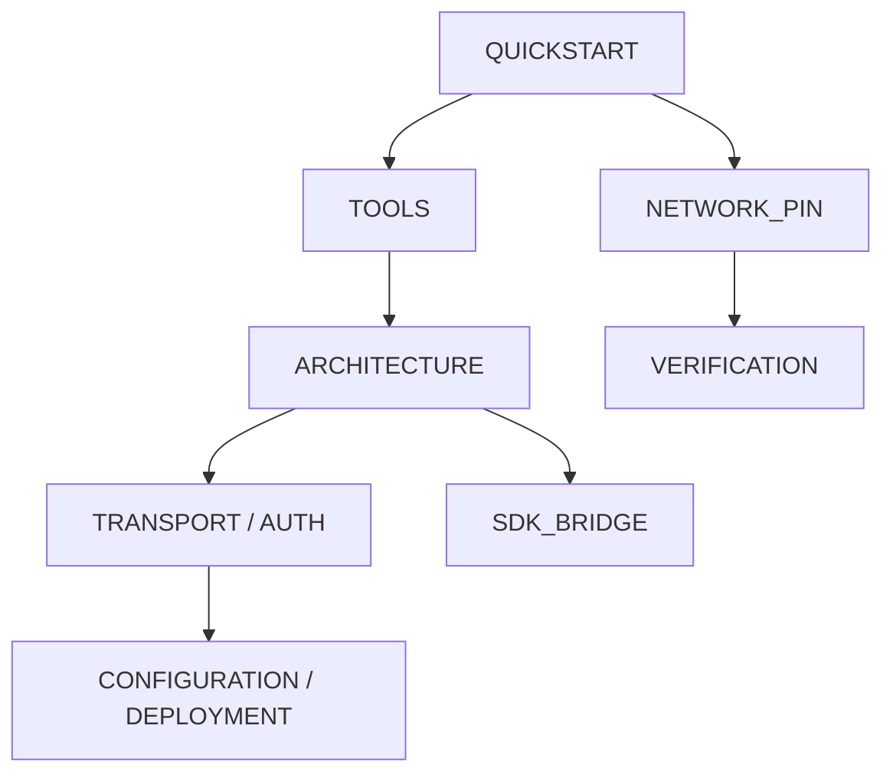

# Documentation Hub — `@veyanet/mcp`

This folder is the documentation set for `@veyanet/mcp`, the Streamable HTTP Model Context Protocol server for VEYA on Robinhood Chain testnet **46630**.

The root [README.md](../README.md) is the publish-facing intro. **CHANGELOG.md** at the repo root is the version history (leave that file as the source of releases). This hub is how a stranger learns **how the server is built** and **what each tool does**.

---

## Start here

1. Paste `https://mcp.veyanet.tech/mcp` into Claude or Cursor (Streamable HTTP).
2. Read [QUICKSTART.md](./QUICKSTART.md) and run `veya_describe` → `veya_ping_chain`.
3. Confirm pins in [NETWORK_PIN.md](./NETWORK_PIN.md).
4. Look up any tool in [TOOLS.md](./TOOLS.md).
5. For pictures of trust and layers, read [ARCHITECTURE.md](./ARCHITECTURE.md).

You need **public MCP**, optionally **`@veyanet/sdk`**, and the **product API** at `https://api.veyanet.tech`.

---

## Reading paths

| If you want to… | Read |
|-----------------|------|
| Connect in five minutes | [QUICKSTART.md](./QUICKSTART.md) |
| Know chain id, contract, public URLs | [NETWORK_PIN.md](./NETWORK_PIN.md) |
| Understand **every tool** (what it does, args, returns) | [TOOLS.md](./TOOLS.md) |
| See layers, sequence charts, trust, failures | [ARCHITECTURE.md](./ARCHITECTURE.md) |
| Know HTTP paths, SSE, CORS, stateless `/mcp` | [TRANSPORT.md](./TRANSPORT.md) |
| Know product key vs your wallet | [AUTHENTICATION.md](./AUTHENTICATION.md) |
| Self-host env vars | [CONFIGURATION.md](./CONFIGURATION.md) |
| Put TLS in front of Node | [DEPLOYMENT.md](./DEPLOYMENT.md) |
| Prove it as an auditor | [VERIFICATION.md](./VERIFICATION.md) |
| See what is SDK vs API | [SDK_BRIDGE.md](./SDK_BRIDGE.md) |
| Contribute a tool | [../CONTRIBUTING.md](../CONTRIBUTING.md) |
| Report a security bug | [../SECURITY.md](../SECURITY.md) |

---

## Package facts

| Item | Value |
|------|-------|
| npm | `@veyanet/mcp` **1.2.3** |
| SDK | `@veyanet/sdk` **^1.2.4** |
| Public connector | `https://mcp.veyanet.tech/mcp` |
| Product API | `https://api.veyanet.tech` |
| Chain | Robinhood testnet **46630** |
| Contract | `Veya.sol` `0x1a1Dc3c55550FCE9F70ef6cDEeF967c0b72a5d84` |
| Sealed | AES-256-GCM |
| Writes | User-paid (product `apiKey` + your wallet) |

---

## Live facts

- `Veya.sol` is a protocol contract (environments, agents, commitments, attestations).
- Settlement is Robinhood **testnet 46630**.
- Guest sessions are **Use-only** (Build returns API **403**).
- Quorum is matching BLAKE3 hashes (2-of-3); unreachable nodes return `consensus_reached: false`.
- Public paste URL is `https://mcp.veyanet.tech/mcp`.
