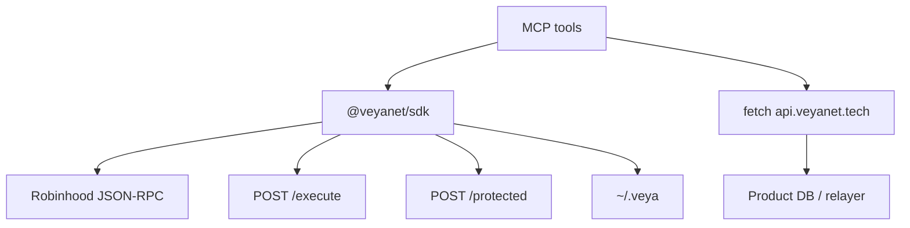

# SDK Bridge — `@veyanet/mcp` ↔ `@veyanet/sdk`

This MCP server **imports** `@veyanet/sdk` for hashing, PQ crypto, receipt parsing, and `Veya.sol` writes. Product rooms go through `fetch` to the product API.

Strangers install packages from npm only:

```bash
npm install @veyanet/sdk
# Agent paste URL (no install):
# https://mcp.veyanet.tech/mcp
```

**[Architecture](./ARCHITECTURE.md)** • **[Tools](./TOOLS.md)** • **[Configuration](./CONFIGURATION.md)**

---

## Table of contents

1. [Why two packages](#1-why-two-packages)
2. [Declared dependency](#2-declared-dependency)
3. [Factories in `src/sdk.ts`](#3-factories-in-srcsdkts)
4. [Named SDK exports](#4-named-sdk-exports)
5. [Tool → backend map](#5-tool--backend-map)
6. [Hex helpers](#6-hex-helpers)
7. [Product API HTTP client](#7-product-api-http-client)
8. [Version skew](#8-version-skew)
9. [When to use the SDK in your process](#9-when-to-use-the-sdk-in-your-process)

---

## 1. Why two packages

| Package | Job |
|---------|-----|
| `@veyanet/sdk` | Crypto, chain-id guard, consensus client, sealed client, `EvmAnchor` |
| `@veyanet/mcp` | Streamable HTTP, tool names, product `apiKey` forwarding, honesty card, user-paid `EvmAnchor` writes |

Agents should not paste a mainnet key into a public MCP tool argument. Prefer a self-hosted MCP with `VEYA_PAYER_PRIVATE_KEY`. App servers that want full control import the SDK and never run MCP.

The hosted product API also imports the SDK. Same pins: chain **46630**, `Veya.sol` `0x1a1Dc3c55550FCE9F70ef6cDEeF967c0b72a5d84`.

---

## 2. Declared dependency

From this package’s `package.json`:

```json
"@veyanet/sdk": "^1.2.3"
```

MCP version is **1.2.2**. SDK version is **^1.2.3** (caret). A clone of this repo runs `npm install` and pulls the SDK from the **npm registry**. Publish the SDK before the MCP so the chain-read tools resolve.

---

## 3. Factories in `src/sdk.ts`

### `createReadClient(cfg)`

```ts
new VeyaClient({
  rpcUrl: cfg.rpcUrl,
  contractAddress: cfg.contractAddress,
  chainId: cfg.chainId,
  explorerUrl: cfg.explorerUrl,
  validatorNodes: cfg.validatorNodes,
  sealedNodeUrl: cfg.sealedNodeUrl,
})
```

No `payerPrivateKey`. Used for ping, hash, verify, on-chain reads, `runConsensus` via the client, PQ keygen.

### `createWriteClient(cfg, payerPrivateKey)`

Same fields plus the **user's** `payerPrivateKey`. Used only by write tools after a product `apiKey` check. The hosted relayer is not passed here.

---

## 4. Named SDK exports

`src/tools/crypto.ts` and `src/tools/fleet.ts` also import named SDK exports:

| Import | Used by |
|--------|---------|
| `pq` | sign/verify UTF-8, `publicKeyHashBlake3` |
| `runConsensus` | `veya_run_consensus` |
| `protectedExec` + `requireVerifiedSeal` | `veya_sealed_execute` |
| `setToolPolicy` | `veya_set_tool_policy` |
| `routeMessage` | `veya_route_message` |
| `routeSecureMessage` | `veya_route_secure_message` |
| `verifySecureMessage` | `veya_verify_secure_message` |
| `storeMemory` / `readMemory` / `invalidateMemory` | local `~/.veya` tools |

In-process Boundnet and `~/.veya` memory live in the **MCP Node process**, not in the product database.

---

## 5. Tool → backend map



| Area | Backend |
|------|---------|
| Ping, verify tx, BLAKE3, `commitmentExists`, read environment/agent | SDK → Robinhood RPC |
| PQ keygen/sign/verify/fingerprint | SDK `pq` in this process |
| Consensus / sealed | SDK HTTP to `cfg.validatorNodes` / `cfg.sealedNodeUrl` |
| Public stats, agents, certificates, executions | `GET {api}/public/...` |
| Guest, rooms, agents, proofs, Boundnet invoke, protected exec | `{api}/auth`, `{api}/v1/...` |
| Proof verify | `{api}/api/verify/:signature` |
| On-chain writes | SDK `EvmAnchor` with the **user** payer key (`msg.sender` is the user) |

Exact tool names: [TOOLS.md](./TOOLS.md).

---

## 6. Hex helpers

`parseHexBytes(value, expectedLen?)` in `src/sdk.ts`:

- Strips `0x`
- Requires even-length hex
- Optional exact byte length (16 for environment/agent UUID, 32 for digests)

Write and registry tools use this so a 15-byte UUID cannot silently pad.

Crypto/fleet tools have a local `hexToBytes` with the same even-length rule.

---

## 7. Product API HTTP client

MCP `src/api.ts` `apiRequest`:

- Timeout 20 s
- Optional JSON body
- Product keys sent as `X-Api-Key` (and Bearer); JWTs as Bearer only
- Returns `{ httpStatus, body }`. HTTP 4xx/5xx also set MCP `isError`.

That path never constructs `VeyaClient`. The API server, elsewhere, uses the SDK for its own relayer.

---

## 8. Version skew

If MCP health says one contract address and `npm view @veyanet/sdk` docs say another, treat it as a **bug**. Pins must match [NETWORK_PIN.md](./NETWORK_PIN.md).

SDK chain-id guard still applies on writes even if MCP env is wrong: a lying RPC that is not 46630 should refuse send.

---

## 9. When to use the SDK in your process

Use `@veyanet/sdk` in your own Node process when you want crypto and chain calls in-process.

Use MCP when an agent runtime should call VEYA over the paste URL, with the public honesty card.

Related SDK docs live in the SDK repo: architecture, post-quantum, sealed execution. This file only explains the **bridge**.
