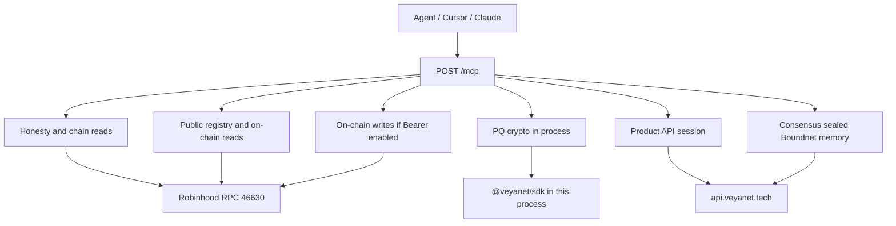

# Tools Reference — `@veyanet/mcp`

This is the full catalog of tools the MCP server can offer an agent (Claude, Cursor, or any MCP client). Every description below is taken from the real handlers in `src/tools/*.ts`. Nothing here is a wishlist.

Paste this URL:

```text
https://mcp.veyanet.tech/mcp
```

Cryptography and chain reads go through `@veyanet/sdk`. Product sessions and registry go through `https://api.veyanet.tech`. Consensus and sealed capacity belong to that API’s fleet. On-chain writes (when enabled on an MCP host) go through the SDK relayer key on **that** host.

**[Architecture](./ARCHITECTURE.md)** • **[Quickstart](./QUICKSTART.md)** • **[Authentication](./AUTHENTICATION.md)** • **[SDK bridge](./SDK_BRIDGE.md)**

---

## Table of contents

1. [How to read this file](#how-to-read-this-file)
2. [Map: which drawer to open](#map-which-drawer-to-open)
3. [How replies look](#how-replies-look)
4. [1. Honesty and public chain reads](#1-honesty-and-public-chain-reads)
5. [2. Post-quantum crypto](#2-post-quantum-crypto-in-this-process)
6. [3. Fleet, sealed, Boundnet, local memory](#3-fleet-sealed-boundnet-local-memory)
7. [4. Public registry and on-chain reads](#4-public-registry-and-on-chain-reads)
8. [5. Product API (session)](#5-product-api-session)
9. [6. On-chain write tools (Bearer)](#6-on-chain-write-tools-bearer)
10. [Live facts](#live-facts)
11. [Index of tool names](#index-of-tool-names)

---

## How to read this file

Every tool below answers four questions in simple words:

1. **What it does**
2. **When to use it**
3. **Arguments** (what you pass)
4. **What you get back**

Auth is one of:

| Label | Meaning |
|-------|---------|
| **None** | Anyone connected to the MCP URL |
| **Session** | Pass `sessionToken` from `veya_guest_login` or a **wallet** JWT from the product API |
| **Bearer** | HTTP `Authorization: Bearer <MCP_API_KEY>` on the MCP host, plus a relayer key on that host |

Guest sessions are **Use only**. Create environment, deploy agent, protected execution, Boundnet invoke as Build: the **product API returns 403**. That is policy, not a bug.

If validators or sealed-node are down, consensus/sealed tools **fail closed**. MCP never invents a matching hash.

Public `mcp.veyanet.tech` often keeps **Bearer writes off**. Then you see `veya_writes_status` instead of store/attest tools.

Approximate count: **~43 tools** with writes off, **~47** with writes on.

---

## Map: which drawer to open



| You want to… | Start with |
|--------------|------------|
| Know what this server is | `veya_describe` |
| See if the chain is alive | `veya_ping_chain` |
| Check a known tx | `veya_verify_transaction` |
| Hash text the VEYA way | `veya_hash_blake3` |
| See if the product API / fleet is honest | `veya_api_health` |
| Make PQ keys (no chain) | `veya_pq_keygen` |
| Run 2-of-3 (if fleet up) | `veya_run_consensus` |
| Seal a payload (if sealed up) | `veya_sealed_execute` |
| Browse public agents / certificates | `veya_public_list_*` |
| Guest stamp a proof | `veya_guest_login` then `veya_anchor_proof` |
| Build a room | Wallet session — not guest |

---

## How replies look

MCP tools return MCP `content` items. This server almost always puts **one text item** whose body is pretty-printed JSON.

| Helper | Used by | Shape |
|--------|---------|--------|
| Raw `JSON.stringify` in the handler | `public.ts` describe/ping/hash/verify/health, writes | Direct object JSON |
| `toolJson(data)` | crypto, fleet, registry, product | Same: JSON text |
| `toolError(err)` | those files on throw | `{ "error": "<message>" }` and `isError: true` |

Product and public-registry tools wrap the HTTP call as:

```json
{ "httpStatus": 200, "body": { } }
```

A guest Build call still “succeeds” as an MCP tool if the API returned JSON — look at `httpStatus` **403**. That is the real answer.

`veya_api_health` uses `{ "httpStatus", "body" }` from `GET {VEYA_API_URL}/health` (8 second timeout). Other API tools use a 20 second timeout (`src/api.ts`).

Hex arguments: strip `0x` is fine. Environment/agent UUIDs on chain are **16 bytes** (32 hex chars). Digests are **32 bytes** (64 hex chars). Wrong length fails closed.

---

# 1. Honesty and public chain reads

**Auth: none.** These are the tools a stranger should try first.

## `veya_describe`

**What it does.** Returns a JSON honesty card from config: package name and version, public paste URL, Robinhood testnet pin (chain id, contract, RPC, explorer), product API URL, sealed = AES-256-GCM, how writes work, and that fleet is API-owned. Use `veya_ping_chain` for a live RPC check.

**When to use it.** First call after connecting. Diligence. “What is this MCP?”

**Arguments.** None.

**What you get back.** JSON text with `name`, `version`, `publicUrl`, `settlement`, `productApi`, `sealed`, `mainnet`, `writes`, `toolSurface`, `fleet`, `publicPasteUrl`.

---

## `veya_ping_chain`

**What it does.** Asks Robinhood Chain JSON-RPC if it is reachable, what chain id it is, and a bit of block/contract context, using `@veyanet/sdk` `VeyaClient.pingChain()`.

**When to use it.** After describe. If this fails, later verify/write will fail too.

**Arguments.** None.

**What you get back.** Ping fields plus `chainId` as a string, `expectedChainId` from config (should be `46630` on the public product), and `config` from `client.describe()`. On the public pin, that chain id is **46630**.

---

## `veya_hash_blake3`

**What it does.** Hashes your string with **BLAKE3-256** (the same family VEYA uses for commitments). Returns hex.

**When to use it.** You want a digest before `veya_store_commitment` or to compare with an on-chain commitment.

**Arguments.**

| Name | Type | Required |
|------|------|----------|
| `data` | string, min length 1 | yes |

**What you get back.** `{ "hash": "<64-char hex>" }` (shape may include `0x` depending on SDK).

---

## `veya_verify_transaction`

**What it does.** Takes a **mined** Robinhood tx hash, loads the receipt, and parses **Veya.sol** events (commitments and related proofs) through the SDK.

**When to use it.** Someone sent you a tx. You want `valid` / event data / explorer-facing fields without trusting a screenshot.

**Arguments.**

| Name | Type | Required |
|------|------|----------|
| `txHash` | string, min 66 chars (`0x` + 64 hex) | yes |

**What you get back.** SDK verify JSON: typically parsed proofs, hashes, whether the receipt looks like a VEYA write. This is chain-receipt data (what landed on `Veya.sol`).

**Example hash used in docs:**

```text
0xd68ab19671f0a3be63651cb6d6e24f5decf591da981708502827bca3689d31d8
```

---

## `veya_api_health`

**What it does.** `GET {VEYA_API_URL}/health` (default `https://api.veyanet.tech/health`). Returns HTTP status and body.

**When to use it.** You care whether the **product API** (database, relayer, **validators**, **sealed**) is `ok` or **`degraded`**. Degraded usually means fleet down. MCP describe/ping can still work.

**Arguments.** None.

**What you get back.** `{ httpStatus, body }` — body includes `status`, `validators.reachable`, `sealed.reachable`, Robinhood relayer block.

---

## `veya_writes_status`

**What it does.** Only registered when this MCP host has **writes disabled** (no `MCP_API_KEY` or no relayer key). Tells you writes are off and what env vars an operator must set.

**When to use it.** Public MCP: to confirm you cannot store commitments here. That is often **intentional**.

**Arguments.** None.

**What you get back.** `{ writesEnabled: false, reason: "..." }`.

---

# 2. Post-quantum crypto (in this process)

**Auth: none.** Keys are generated **here**, not on chain, unless you later call a Bearer write tool.

Treat `privateKeyHex` like a secret. Do not paste it into public chats.

## `veya_pq_keygen`

**What it does.** Makes an **ML-DSA-44** keypair (FIPS 204 style identity used across VEYA). Also returns BLAKE3 of the public key.

**When to use it.** You need an agent/operator PQ identity before signing or registering on chain.

**Arguments.** None.

**What you get back.** `publicKeyHex`, `privateKeyHex`, `publicKeyHash`. Keep `privateKeyHex` secret.

---

## `veya_pq_sign`

**What it does.** Signs a UTF-8 **message** with ML-DSA-44 using `privateKeyHex`.

**Arguments.**

| Name | Type | Required |
|------|------|----------|
| `message` | string | yes |
| `privateKeyHex` | hex string | yes |

**What you get back.** `{ signatureHex }`. The message is the UTF-8 string you passed.

---

## `veya_pq_verify`

**What it does.** Checks an ML-DSA-44 signature over UTF-8 text.

**Arguments.** `message`, `signatureHex`, `publicKeyHex` (all required).

**What you get back.** `{ valid: true | false }`.

---

## `veya_pq_fingerprint`

**What it does.** BLAKE3 fingerprint of an ML-DSA public key (hex in, hash out). Same idea as the hash stored on chain for identities.

**Arguments.** `publicKeyHex`.

**What you get back.** `{ publicKeyHash }`.

---

# 3. Fleet, sealed, Boundnet, local memory

These call **SDK** helpers. On a public host, validator/sealed URLs should point at **API-owned** capacity. If nothing is listening, you get failure or `consensus_reached: false` — **never a fake agreed hash**.

**Auth: none** on the MCP tool itself. That does **not** mean the fleet is public on the internet. The MCP server process is the one that may reach `127.0.0.1` on the **API machine**. Strangers still only talk to `mcp.veyanet.tech`.

## `veya_run_consensus`

**What it does.** Sends the same `payload` to validator nodes (`POST /execute`). Each node hashes with BLAKE3 and signs with its ML-DSA identity. The SDK checks whether **at least 2 of 3** matching hashes exist.

**When to use it.** You need a quorum digest before attesting on chain.

**Arguments.**

| Name | Type | Required |
|------|------|----------|
| `taskId` | string | yes |
| `payload` | object | no (default `{}`) |
| `nodeUrls` | array of URLs | no — uses server config |

**What you get back.** `ConsensusResult`: `task_id`, `agreed_blake3_hash` (or null), `node_results`, `consensus_reached`, `threshold`, `reachable`. Agreement is **hash equality**. If two nodes are down, `consensus_reached` is false.

---

## `veya_client_run_consensus`

**What it does.** Same job as `veya_run_consensus`, but through `VeyaClient.runConsensus` using this server’s default validator list (no override URLs).

**When to use it.** You want the client defaults, not a custom URL list.

---

## `veya_sealed_execute`

**What it does.** Sends a payload to **sealed-node** (`POST /protected`). Seal is **AES-256-GCM**, plus BLAKE3 of ciphertext and ML-DSA over the execution hash. The tool then runs `requireVerifiedSeal` so a 200 with `verified: false` cannot look like success.

**When to use it.** Sensitive agent payload that should not sit in plaintext on the API process.

**Arguments.**

| Name | Type | Required |
|------|------|----------|
| `environmentId` | string | yes |
| `agentId` | string | yes |
| `eventType` | string | yes |
| `payload` | object | yes |
| `sessionEntropyHex` | hex, min 16 chars | yes |
| `sealedNodeUrl` | URL | no — server default |

**What you get back.** Sealed execution result JSON (commitment, verified flag, hashes). If unverified, the call errors. Seal is **AES-256-GCM**.

---

## `veya_set_tool_policy`

**What it does.** In **this MCP process**, allow or deny a tool name for an `agentId` (SDK Boundnet map). Deny-by-default: if you never allow, route should deny.

**Arguments.** `agentId`, `tool` (name), `allowed` (boolean).

**What you get back.** `{ ok, agentId, tool, allowed }`.

On the **public** path (`POST /mcp`), the MCP server object is created **per request** and thrown away. A policy you set in one tool call applies only to that request. Lasting room policy is `veya_boundnet_invoke` on the product API.

---

## `veya_route_message`

**What it does.** Checks Boundnet policy, then routes an inter-agent message (`fromAgent` → `toAgent` calling `tool` with `payload`).

**Arguments.** `id`, `fromAgent`, `toAgent`, `tool`, `payload`.

**What you get back.** Route result including `policyStatus` (`allowed` / `denied`). Denied stays `denied`.

---

## `veya_route_secure_message`

**What it does.** Same policy check, then wraps the message in a **Kyber-768** session and **ML-DSA-44** signature (harvest-now resistant envelope).

**Arguments.** Same as route plus `senderPrivateKeyHex`, `senderPublicKeyHex`.

**What you get back.** Secure envelope JSON (session id, signature, policy status).

---

## `veya_verify_secure_message`

**What it does.** Verifies the ML-DSA signature on a secure envelope.

**Arguments.** `message` (object), `senderPublicKeyHex`.

**What you get back.** `{ valid }`.

---

## `veya_store_memory` / `veya_read_memory` / `veya_invalidate_memory`

**What they do.** Local content-addressed memory on the **MCP machine** (`~/.veya`), with BLAKE3 integrity. Read recomputes the hash. Invalidate is spend-once / nullify for that local entry. Product console proofs use `veya_list_proofs` / `veya_anchor_proof` instead.

**Arguments.**

| Tool | Args |
|------|------|
| store | `environmentId`, `agentId`, `data` |
| read | `environmentId`, `id` |
| invalidate | `environmentId`, `id` |

---

# 4. Public registry and on-chain reads

**Auth: none.** Registry JSON comes from the **product API** `/public/*`. On-chain reads use SDK `eth_call` against `Veya.sol`.

| Tool | Backend |
|------|---------|
| `veya_public_stats` | `GET /public/stats` |
| `veya_public_list_agents` | `GET /public/agents?limit&offset` |
| `veya_public_get_agent` | `GET /public/agents/:id` |
| `veya_public_list_certificates` | `GET /public/certificates?limit&offset` |
| `veya_public_get_certificate` | `GET /public/certificates/:id` |
| `veya_public_get_execution` | `GET /public/executions/:id` |
| `veya_verify_commitment_onchain` | SDK: parse events + `commitments(digest)` |
| `veya_commitment_exists` | SDK: `commitments(bytes32)` |
| `veya_read_environment_onchain` | SDK: environment by 16-byte UUID |
| `veya_read_agent_onchain` | SDK: agent by 16-byte UUID |

Return wrapper for `/public/*` tools: `{ httpStatus, body }`.

## `veya_public_stats`

**What it does.** Public counts (agents, proofs, whatever `/public/stats` returns).

**When to use it.** Landing-style “what is live” without a session.

---

## `veya_public_list_agents` / `veya_public_get_agent`

**What they do.** List or fetch **public** agent registry rows (public fields only).

**Arguments.** List: optional `limit` (1–100), `offset`. Get: `id`.

---

## `veya_public_list_certificates` / `veya_public_get_certificate`

**What they do.** Public attestation / certificate explorer rows (the public proof/certificate surface of the product API).

**Arguments.** Same pagination pattern; get needs `id`.

---

## `veya_public_get_execution`

**What it does.** Fetch one public execution proof by `id` from `/public/executions/:id`.

---

## `veya_verify_commitment_onchain`

**What it does.** Stronger than event-only verify: parse `CommitmentStored` (and related) from the tx, then **`eth_call` `commitments(digest)`** for each digest so the mapping still says the hash exists.

**Arguments.** `txHash` (66+ chars).

**When to use it.** Diligence: “event in the receipt **and** mapping still true.”

---

## `veya_commitment_exists`

**What it does.** `eth_call` `commitments(bytes32)` for one digest.

**Arguments.** `digestHex` (32-byte hex).

**What you get back.** `{ digestHex, onChain: true|false }`.

---

## `veya_read_environment_onchain` / `veya_read_agent_onchain`

**What they do.** Read `Veya.sol` environment or agent records by **16-byte UUID hex**. Wrong UUID length fails closed.

**Arguments.** `environmentUuidHex` or `agentUuidHex` (min 32 hex chars).

---

# 5. Product API (session)

These tools call `https://api.veyanet.tech` (or `VEYA_API_URL`). Return wrapper: `{ httpStatus, body }`.

**Auth: Session** — pass `sessionToken` unless noted.

| Tool | HTTP |
|------|------|
| `veya_guest_login` | `POST /auth/guest` (no token) |
| `veya_list_environments` | `GET /v1/environments` |
| `veya_get_environment` | `GET /v1/environments/:id` |
| `veya_create_environment` | `POST /v1/environments` |
| `veya_list_agents` | `GET /v1/environments/:id/agents` |
| `veya_deploy_agent` | `POST /v1/environments/:id/agents` |
| `veya_list_api_memory` | `GET /v1/environments/:id/memory` |
| `veya_list_executions` | `GET /v1/environments/:id/executions` |
| `veya_run_protected_execution` | `POST /v1/environments/:id/executions/protected` |
| `veya_boundnet_invoke` | `POST /v1/environments/:id/boundnet/invoke` |
| `veya_list_proofs` | `GET /v1/proofs` |
| `veya_anchor_proof` | `POST /v1/proofs/anchor` |
| `veya_verify_proof_api` | `GET /api/verify/:signature` (no session) |

### Guest vs wallet (read this once)

| Action | Guest | Wallet |
|--------|-------|--------|
| Login | `veya_guest_login` | Product API `/auth/nonce` + `/auth/verify` (not an MCP wallet popup) |
| List showcase / Use proofs | Yes | Yes |
| Anchor content proof | Yes (Use) | Yes |
| Create environment | **403** | Yes |
| Deploy agent | **403** | Yes |
| Protected execution | **403** | Yes |
| Boundnet invoke | Policy + guest 403 on Build | Wallet + allowlist |

---

## `veya_guest_login`

**What it does.** `POST /auth/guest` on the product API. Returns a JWT for **Use-only**.

**When to use it.** Agent should stamp/list proofs with a Use session.

**Arguments.** None.

**What you get back.** Token, `mode: guest`, wallet label of the **relayer** (shared). Treat it as a shared demo Use session. Guest Build tools return API **403**.

---

## `veya_list_environments` / `veya_get_environment`

**What they do.** List rooms for the session, or get one by `environmentId`. Guest sees Use/showcase scope, not other people’s Build rooms.

**Arguments.** `sessionToken` (required for a useful call). Get also needs `environmentId`.

---

## `veya_create_environment`

**What it does.** `POST /v1/environments` — **Build**.

**Arguments.** `sessionToken`, `name`, `type` (`research` \| `governance` \| `treasury` \| `contributor` \| `protocol` \| `desci`).

**Guest:** **403**. Invalid type still 403 for guest (gate before schema tricks).

---

## `veya_list_agents` / `veya_deploy_agent`

**What they do.** List agents in a room, or deploy one (**Build**).

**Deploy arguments.** `sessionToken`, `environmentId`, `type`, optional `permissionConfig` (object — e.g. allowed tools).

**Guest deploy:** **403**.

---

## `veya_list_api_memory` / `veya_list_executions`

**What they do.** List **product API** memory rows or execution rows for an environment (hosted DB), not `~/.veya` MCP-local memory.

**Memory optional `scope`:** `environment` \| `agent` \| `session`.

---

## `veya_run_protected_execution`

**What it does.** `POST .../executions/protected` on the API — sealed path as the **hosted product** runs it (AES-256-GCM on the API’s sealed-node). **Build.** Guest **403**.

**Arguments.** `sessionToken`, `environmentId`, `agentId`, `eventType`, `payload`, optional `disclose` / `seal` field name lists.

---

## `veya_boundnet_invoke`

**What it does.** `POST .../boundnet/invoke` — agent may call `toolName` only if policy allows. Deny-by-default on the **product** side.

**Arguments.** `sessionToken`, `environmentId`, `agentId`, `toolName`, optional `arguments` object.

**Guest:** Build-gated (403) like other writes.

---

## `veya_list_proofs` / `veya_anchor_proof`

**What they do.** Use-mode proofs: list your stamps, or paste `label` + `content` and get a chain-backed proof (tx hash) via `POST /v1/proofs/anchor`.

**Guest:** allowed on Use (API relayer pays testnet gas, with caps). This is **not** the official token customer story; it is the product Use path.

**Anchor arguments.** `sessionToken`, `label`, `content`.

**What you get back.** Proof id, content hash, `attestationTx`, explorer fields.

---

## `veya_verify_proof_api`

**What it does.** Public product verify: `GET /api/verify/:signature` (tx hash). No session required.

**Arguments.** `signature` (tx hash string).

**What you get back.** `{ valid: true|false, ... }` — failures are visible, not hidden.

---

# 6. On-chain write tools (Bearer)

Registered **only** if this MCP process has `MCP_API_KEY` **and** `VEYA_RELAYER_PRIVATE_KEY` (or deployer alias). Every call still needs:

```http
Authorization: Bearer <MCP_API_KEY>
```

Public `mcp.veyanet.tech` should usually **not** enable these.

These spend **testnet gas** from the relayer. They are not guest Use stamps (prefer `veya_anchor_proof` + product API for human content proofs).

## `veya_store_commitment`

Stores a 32-byte digest on `Veya.sol` `storeCommitment` for a 16-byte environment UUID.

**Args.** `environmentUuidHex`, `commitmentHex`.

**Returns.** `{ txHash, explorer }`.

---

## `veya_attest_execution`

`attestExecution` with BLAKE3 execution hash and ML-DSA signature bytes.

**Args.** `environmentUuidHex`, `blake3HashHex`, `mldsaSigHex`.

---

## `veya_register_environment`

`registerEnvironment` with PQ public-key hash and `envType` (0–10, default 0).

**Args.** `environmentUuidHex`, `pqPubkeyHashHex`, `envType`.

---

## `veya_register_pq_onchain`

Generates ML-DSA keys in process, then registers environment + a commitment on chain (operator helper).

**Args.** optional `envType` (default 1).

**Returns.** public key hex/hash, `environmentTx`, `memoTx`, explorer. **Does not return the private key in the snippet above** — treat whatever the SDK returns as custody-sensitive; do not log it.

---

## `veya_anchor_pq_attestation`

Links identity hash to execution hash on chain (`anchorPqAttestation`).

**Args.** `environmentUuidHex`, `identityHashHex`, `executionHashHex`.

---

# Live facts

| Claim | Live value |
|-------|--------|
| Sealed | AES-256-GCM |
| Chain | Robinhood **testnet 46630** |
| Guest Build | 403 |
| Quorum | Real 2-of-3 or fail closed |
| `Veya.sol` | Protocol contract |
| Public path | Public MCP + npm SDK + `api.veyanet.tech` |

## Index of tool names

| Tool | Group | Auth |
|------|-------|------|
| `veya_describe` | Public | None |
| `veya_ping_chain` | Public | None |
| `veya_hash_blake3` | Public | None |
| `veya_verify_transaction` | Public | None |
| `veya_api_health` | Public | None |
| `veya_writes_status` | Writes-off only | None |
| `veya_pq_keygen` | Crypto | None |
| `veya_pq_sign` | Crypto | None |
| `veya_pq_verify` | Crypto | None |
| `veya_pq_fingerprint` | Fleet file | None |
| `veya_run_consensus` | Fleet | None |
| `veya_client_run_consensus` | Fleet | None |
| `veya_sealed_execute` | Fleet | None |
| `veya_set_tool_policy` | Fleet (in-process) | None |
| `veya_route_message` | Fleet (in-process) | None |
| `veya_route_secure_message` | Fleet (in-process) | None |
| `veya_verify_secure_message` | Fleet (in-process) | None |
| `veya_store_memory` | Fleet (`~/.veya`) | None |
| `veya_read_memory` | Fleet (`~/.veya`) | None |
| `veya_invalidate_memory` | Fleet (`~/.veya`) | None |
| `veya_public_stats` | Registry | None |
| `veya_public_list_agents` | Registry | None |
| `veya_public_get_agent` | Registry | None |
| `veya_public_list_certificates` | Registry | None |
| `veya_public_get_certificate` | Registry | None |
| `veya_public_get_execution` | Registry | None |
| `veya_verify_commitment_onchain` | Registry | None |
| `veya_commitment_exists` | Registry | None |
| `veya_read_environment_onchain` | Registry | None |
| `veya_read_agent_onchain` | Registry | None |
| `veya_guest_login` | Product | None (issues a session) |
| `veya_list_environments` | Product | Session |
| `veya_get_environment` | Product | Session |
| `veya_create_environment` | Product | Session (guest **403**) |
| `veya_list_agents` | Product | Session |
| `veya_deploy_agent` | Product | Session (guest **403**) |
| `veya_list_api_memory` | Product | Session |
| `veya_list_executions` | Product | Session |
| `veya_run_protected_execution` | Product | Session (guest **403**) |
| `veya_boundnet_invoke` | Product | Session (guest **403**) |
| `veya_list_proofs` | Product | Session |
| `veya_anchor_proof` | Product | Session (Use allowed) |
| `veya_verify_proof_api` | Product | None |
| `veya_store_commitment` | Writes | Bearer |
| `veya_attest_execution` | Writes | Bearer |
| `veya_register_environment` | Writes | Bearer |
| `veya_register_pq_onchain` | Writes | Bearer |
| `veya_anchor_pq_attestation` | Writes | Bearer |

## Related

- [ARCHITECTURE.md](./ARCHITECTURE.md) — pictures of how tools sit in the system  
- [AUTHENTICATION.md](./AUTHENTICATION.md) — Bearer and sessions  
- [SDK_BRIDGE.md](./SDK_BRIDGE.md) — what is SDK vs API  
- [NETWORK_PIN.md](./NETWORK_PIN.md) — chain constants  
- [QUICKSTART.md](./QUICKSTART.md) — first five minutes  
- [TRANSPORT.md](./TRANSPORT.md) — why in-process Boundnet does not survive `POST /mcp`  
